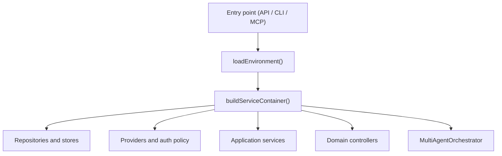
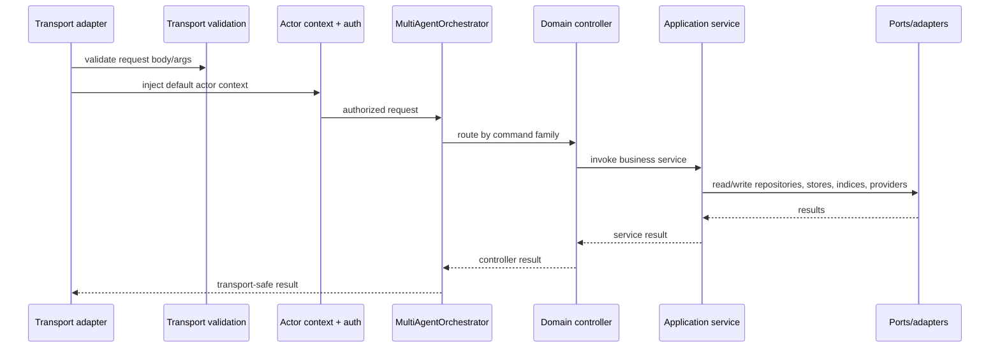
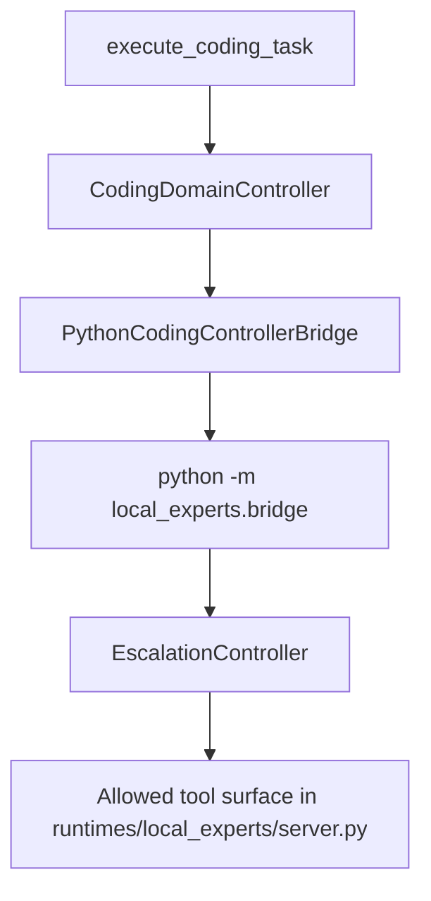

# Runtime flow

This file describes how requests move through the current implementation.

## Startup flow

Key files:

- `apps/brain-api/src/main.ts`
- `apps/brain-cli/src/main.ts`
- `apps/brain-mcp/src/main.ts`
- `packages/infrastructure/src/config/env.ts`
- `packages/infrastructure/src/bootstrap/build-service-container.ts`

## Request flow for routed commands

Transport examples:

- HTTP uses `validateTransportRequest()` in `apps/brain-api/src/server.ts`
- CLI uses the same validation in `apps/brain-cli/src/main.ts`
- MCP uses the same validation in `apps/brain-mcp/src/main.ts`

## Retrieval flow

The default retrieval path lives in `packages/application/src/services/retrieve-context-service.ts`.

High-level sequence:

1. classify the query intent
2. run lexical retrieval
3. run vector retrieval
4. fuse rankings
5. optionally rerank
6. assess answerability
7. assemble a bounded packet
8. emit freshness and degradation warnings
9. optionally enrich uncertainty with the paid escalation provider
10. record audit history

Important runtime detail:

- if `request.strategy === "hierarchical"` and the hierarchical service is present, retrieval diverts to `HierarchicalRetrievalService`

## Drafting and promotion flow

### Draft creation

`packages/application/src/services/staging-draft-service.ts`:

1. checks actor role
2. checks corpus/source boundary rules
3. builds draft frontmatter and path
4. generates a body from either:
   - the drafting provider, or
   - a deterministic fallback body
5. validates the draft
6. persists the staging draft
7. mirrors note metadata into SQLite

### Promotion

`packages/application/src/services/promotion-orchestrator-service.ts`:

1. loads the staging draft
2. checks revision expectations
3. validates the promotion candidate
4. checks duplicate signatures
5. finds superseded current-state notes when needed
6. optionally prepares a snapshot note for current-state promotions
7. enqueues promotion work into the SQLite promotion outbox
8. processes the outbox entry inline
9. writes canonical files
10. syncs chunk metadata, lexical index, and vector index
11. records promotion metadata and audit history
12. marks the staging draft as promoted
13. attempts derived representation regeneration

Important boundary:

- derived representation regeneration failure does not block authoritative promotion according to the tracked regression tests

## Import flow

`packages/application/src/services/import-orchestration-service.ts`:

1. resolves and reads the source file
2. hashes and summarizes the source
3. records an import job in SQLite
4. returns recorded state

Current behavior:

- it does not create canonical outputs directly
- it does not create staging drafts directly

## Session archive flow

`packages/application/src/services/session-archive-service.ts`:

1. validates `sessionId` and messages
2. creates an immutable archive record with authority state `session`
3. persists the archive in SQLite

Current behavior:

- it does not write canonical notes
- it does not create staging drafts

## Coding flow

The Node bridge:

- spawns Python
- passes JSON over stdin/stdout
- injects `PYTHONPATH`
- derives `OLLAMA_API_URL`
- passes the configured coding model
- converts bridge failures into coding-task responses

## Evidence status

### Verified facts

- Flow descriptions come from the tracked entrypoints, services, and tests

### Assumptions

- None

### TODO gaps

- If promotion replay becomes out-of-process instead of inline, update the promotion flow section
