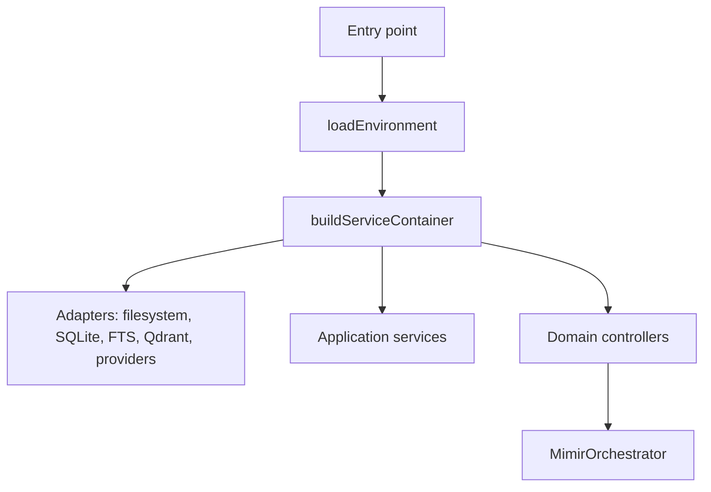

# mimir Complete Operator and Developer Manual

Source-reviewed: 2026-04-28.

This manual is the refactored dual-audience manual for `mimir`. It is written
for operators who need to run the system safely and for developers who need to
trace how the system works internally.

Evidence used for this rewrite:

- `README.md`
- `package.json`
- `apps/mimir-api/src/server.ts`
- `apps/mimir-cli/src/main.ts`
- `apps/mimir-mcp/src/main.ts`
- `apps/mimir-control-mcp/src/main.ts`
- `apps/mimir-toolbox-mcp/src/main.ts`
- `documentation/setup/installation.md`
- `documentation/setup/configuration.md`
- `documentation/operations/running.md`
- `documentation/operations/docker-mcp-session.md`
- `documentation/operations/docker-toolbox-v1.md`
- `documentation/operations/toolbox-operator-guide.md`
- `documentation/architecture/overview.md`
- `documentation/architecture/runtime-flow.md`
- `documentation/architecture/invariants-and-boundaries.md`
- `documentation/reference/interfaces.md`
- `documentation/reference/env-vars.md`
- `documentation/testing/README.md`

The original manual had 38 main sections plus nested subsections. This rewrite
treats those 38 `##` sections as the section units and folds the nested
subsections into their parent section. No major original topic was intentionally
dropped.

## Terminology and Evidence Contract

Use these terms consistently throughout the manual:

| Term | Meaning |
| --- | --- |
| `mimir` | The app and orchestrator in this repository. |
| `mimisbrunnr` | The governed memory and context layer inside `mimir`. |
| Operator | A person running, configuring, or reviewing the system. |
| Developer | A person changing code, tests, scripts, or tracked docs. |
| Transport | A way to call the shared runtime: CLI, HTTP, direct MCP, control MCP, or toolbox broker MCP. |
| MCP | Model Context Protocol, a JSON-RPC tool protocol used by agent clients. |
| Actor | The identity attached to a request, including role, source, transport, and token where required. |
| Canonical memory | Promoted durable Markdown note state used as authority. |
| Staging draft | A proposed note that must be reviewed before it becomes canonical memory. |
| Session archive | Immutable, searchable conversation continuity that is not authoritative. |
| Import job | A recorded source-file digest and preview; it is not memory by itself. |
| Context packet | A bounded read product assembled from retrieval candidates and budgets. |
| Qdrant | Optional vector database used for vector retrieval. |
| SQLite FTS | SQLite full-text search used for lexical retrieval. |
| Toolbox | A governed set of tools exposed to agents through policy and session state. |

Source-of-truth rule:

- Code and generated tests define runtime behavior.
- `documentation/reference/interfaces.md` defines the tracked public interface
  inventory.
- Local `.codesight` files are generated helpers and must not be manually
  treated as authority.
- This manual explains operation and developer tracing; it does not replace
  tests or source code.

## Section: Start Here If You Are New

### 1. Purpose (Rewritten)

This section prevents first-time users from accidentally creating durable
memory before they understand the authority model. It is for both operators and
developers.

### 2. High-Level Explanation (Non-Technical Layer)

Think of `mimir` as a guarded notebook for agents. A chat transcript can be
saved for later recall, but it is not automatically trusted as fact. A durable
fact must be written as a draft, checked, reviewed, and promoted.

Minimal mental model:

```text
session archive = safe continuity
staging draft = reviewable proposal
canonical memory = promoted durable authority
```

### 3. System-Level Explanation (Engineering Layer)

All entrypoints build the same service container. Read paths retrieve bounded
context. Write paths create one of several state types: session archives,
staging drafts, import jobs, audit records, traces, tool-output spillovers, or
canonical notes after promotion.

### 4. Implementation Details

Primary files:

- `packages/infrastructure/src/bootstrap/build-service-container.ts`
- `packages/orchestration/src/root/mimir-orchestrator.ts`
- `packages/application/src/services/session-archive-service.ts`
- `packages/application/src/services/staging-draft-service.ts`
- `packages/application/src/services/promotion-orchestrator-service.ts`

Commands to learn first:

- `version`
- `auth-status`
- `create-session-archive`
- `search-session-archives`
- `draft-note`

### 5. Step-by-Step Usage

| Path | Input | Action | Expected output | Verification method |
| --- | --- | --- | --- | --- |
| Minimal | Built workspace | Run `corepack pnpm cli -- version` | JSON with release metadata | Command exits with code 0 and contains `ok` or version fields |
| Minimal | None or operator actor payload | Run `corepack pnpm cli -- auth-status --json "{}"` in permissive mode | Auth summary | Output names auth mode and registry summary |
| Full | Session messages | Run `create-session-archive` | Archive ID or stored record | Search the same session with `search-session-archives` |
| Full | Durable fact candidate | Run `draft-note` | Draft ID and staging path | Confirm the draft is under the staging root, not canonical root |

### 6. Failure Modes and Diagnostics

| Step | What can fail | Root cause | Observable symptom | Verify | Recover |
| --- | --- | --- | --- | --- | --- |
| Version | Command not found | Dependencies not installed or wrong directory | Shell error | Check current directory and run build | Run install/build from repo root |
| Auth status | Forbidden | Enforced auth without actor context | JSON error `forbidden` | Inspect `MAB_AUTH_MODE` | Provide operator/system actor payload |
| Archive | Validation failure | Empty session ID or messages | JSON error `validation_failed` | Re-read payload fields | Add `sessionId` and non-empty messages |
| Draft | Validation failure | Missing required draft fields | JSON error with details | Check response details | Add `targetCorpus`, `noteType`, `title`, sources, and hints |

### 7. Assumptions and Hidden Constraints

- The repository has already been cloned.
- Commands run from the active repo root: `F:\Dev\scripts\Mimir\mimir` in this
  workspace.
- The Node apps do not auto-load `.env`.
- Session archives can be searched, but they are not promoted facts.

### 8. Terminology Clarification

`remembering a session` means storing continuity. `creating memory` means
creating canonical authority through draft, validation, review, and promotion.

### 9. Gaps / Issues in Original Manual

- It warned users not to promote too early, but it mixed the safe-tour details
  with later transport details.
- It did not explicitly state that every entrypoint shares one runtime
  container.
- It did not consistently identify verification after each beginner step.

### 10. Refactored Section (Final Version)

Start by proving the system runs, then store only non-authoritative continuity.
Run `version`, inspect auth, create a session archive, search that archive, and
only then create a staging draft. Do not promote a draft until you understand
validation, review, and promotion. Canonical memory is the durable authority
surface; session archives and drafts are safer learning surfaces.

## Section: 1. Mental Model

### 1. Purpose (Rewritten)

This section defines the smallest correct model of the system. It is for both
operators and developers.

### 2. High-Level Explanation (Non-Technical Layer)

`mimir` helps agents use memory without letting them write trusted facts
silently. It separates remembering, proposing, reviewing, and trusting.

### 3. System-Level Explanation (Engineering Layer)

The runtime has three main responsibilities:

- Governed writes through draft, validation, review, and promotion.
- Bounded reads through retrieval, packets, summaries, namespace nodes, and
  agent-context blocks.
- Local execution support through a Node-to-Python coding bridge with traces
  and spillover storage.

### 4. Implementation Details

Key modules:

- `packages/domain`
- `packages/contracts`
- `packages/application`
- `packages/orchestration`
- `packages/infrastructure`
- `apps/*`
- `runtimes/local_experts`

### 5. Step-by-Step Usage

| Path | Input | Action | Expected output | Verification method |
| --- | --- | --- | --- | --- |
| Minimal | None | Read this model before running write commands | You can classify a command as read, draft, archive, or promote | Compare the command with `documentation/reference/interfaces.md` |
| Full | A candidate fact | Choose archive, draft, or promotion path | Correct authority state | Inspect command response and storage location |

### 6. Failure Modes and Diagnostics

| Failure | Why it happens | Symptom | Verify | Recover |
| --- | --- | --- | --- | --- |
| Treating archive as fact | Continuity and authority are confused | Agent repeats unreviewed transcript as truth | Search result labels session recall as non-authoritative | Create a sourced draft instead |
| Treating draft as fact | Staging and canonical states are confused | Draft exists but retrieval may not show it as canonical evidence | Check staging root and metadata | Validate, review, then promote |

### 7. Assumptions and Hidden Constraints

- Authority is a state transition, not a filename convention.
- Retrieval is bounded by budgets; it is not a raw dump of all notes.
- Local-agent outputs are evidence or proposals, not automatic memory.

### 8. Terminology Clarification

`authority` means the system is allowed to treat a note as durable truth for
retrieval. `bounded` means output is limited by explicit source, excerpt,
summary, and token budgets.

### 9. Gaps / Issues in Original Manual

- It had the right high-level rule, but it did not clearly separate operator
  and engineering views.
- It did not name all state classes up front.

### 10. Refactored Section (Final Version)

Use `mimir` as a governed memory system. Store conversations as session
archives. Store candidate durable knowledge as staging drafts. Promote only
reviewed, validated drafts. Give agents bounded context packets, not unlimited
vault access. Let coding tasks produce traces, proposals, and spillover output;
then review any durable knowledge through the normal memory workflow.

## Section: 2. Repository Scope

### 1. Purpose (Rewritten)

This section tells readers what is inside the tracked repository and what is
not. It is for both audiences.

### 2. High-Level Explanation (Non-Technical Layer)

The repository contains the app, its shared runtime, its command adapters, local
Docker profiles, tests, docs, a vendored Python coding worker, and a vendored
external client subtree. It is not a production deployment platform.

### 3. System-Level Explanation (Engineering Layer)

The workspace is a pnpm TypeScript monorepo with 12 workspace projects. Node
entrypoints call a shared infrastructure bootstrap. Python exists as a vendored
runtime invoked by subprocess, not as the main application host.

### 4. Implementation Details

Main areas:

- `apps/mimir-api`
- `apps/mimir-cli`
- `apps/mimir-mcp`
- `apps/mimir-control-mcp`
- `apps/mimir-toolbox-mcp`
- `packages/domain`
- `packages/contracts`
- `packages/application`
- `packages/orchestration`
- `packages/infrastructure`
- `docker`
- `tests`
- `runtimes/local_experts`
- `vendor/codex-claude-voltagent-client`

Not included:

- Full packaging and publication release pipeline.
- Kubernetes, Helm, Terraform, or production deployment descriptors.
- Tracked SQLite migration system.
- Tracked dotenv loader.

### 5. Step-by-Step Usage

| Path | Input | Action | Expected output | Verification method |
| --- | --- | --- | --- | --- |
| Minimal | Repo root | Run `corepack pnpm build` | TypeScript build artifacts | Exit code 0 |
| Full | Need to locate ownership | Read `documentation/reference/repo-map.md` and `documentation/architecture/overview.md` | Package and adapter map | Confirm files exist under listed directories |

### 6. Failure Modes and Diagnostics

| Failure | Why it happens | Symptom | Verify | Recover |
| --- | --- | --- | --- | --- |
| Running from parent archive | The parent `F:\Dev\scripts\Mimir` contains archive noise | Commands or maps refer to archive files | `git status` from `mimir` root is clean/current | Change into `F:\Dev\scripts\Mimir\mimir` |
| Expecting deployment assets | Repo does not track production descriptors | Missing Helm/Terraform files | Inspect repository tree | Use Docker profiles only, or add deployment work explicitly |

### 7. Assumptions and Hidden Constraints

- The active git repo is the nested `mimir` directory.
- Archive material outside the active repo is not product code.
- Vendored subtrees should not be refactored as ordinary first-party app code.

### 8. Terminology Clarification

`workspace` means the pnpm workspace. `entrypoint` means a process that starts
one app adapter. `vendored` means source kept in-tree for integration stability
but with a separate boundary.

### 9. Gaps / Issues in Original Manual

- It listed the repo areas but omitted the now-live `mimir-control-mcp` and
  `mimir-toolbox-mcp` as first-party Node entrypoints.
- It did not emphasize the nested active repo versus parent archive risk.

### 10. Refactored Section (Final Version)

Treat this as a local-first TypeScript monorepo with a shared runtime, five
Node entrypoints, local Docker profiles, a Python coding worker, and tracked
tests/docs. Do not assume the repo includes production deployment descriptors,
SQLite migrations, dotenv loading, or a full packaging/publication pipeline.
When navigating, start from the nested active repo and source maps under
`documentation/`.

## Section: 3. Source-Backed Architecture

### 1. Purpose (Rewritten)

This section explains the real architecture from code, not from filenames or
intent. It is mainly for developers, with operator context.

### 2. High-Level Explanation (Non-Technical Layer)

Every way of using `mimir` reaches the same engine. The CLI, HTTP server, and
MCP servers are different front doors. Behind them, the same services read and
write notes, indexes, audit records, tools, and coding traces.

### 3. System-Level Explanation (Engineering Layer)

Current dependency direction is practical and layered:

```text
apps -> infrastructure -> orchestration -> application -> contracts/domain
```

Startup flow:



### 4. Implementation Details

Source anchors:

- `packages/infrastructure/src/config/env.ts`
- `packages/infrastructure/src/bootstrap/build-service-container.ts`
- `packages/orchestration/src/root/mimir-orchestrator.ts`
- `packages/infrastructure/src/runtime-command-dispatcher.ts`
- `packages/contracts/src/orchestration/command-catalog.ts`

### 5. Step-by-Step Usage

| Path | Input | Action | Expected output | Verification method |
| --- | --- | --- | --- | --- |
| Minimal | Need a command map | Read `documentation/reference/interfaces.md` | HTTP, CLI, MCP inventory | Compare with command catalog tests |
| Full | Need execution trace | Start at adapter, then follow dispatcher/orchestrator/service/adapters | Concrete data path | Confirm each called module exists in source |

### 6. Failure Modes and Diagnostics

| Failure | Why it happens | Symptom | Verify | Recover |
| --- | --- | --- | --- | --- |
| Wrong source of truth | Generated docs or old manual are stale | Route or command mismatch | Run `corepack pnpm test:interface-docs` and `test:command-surface` | Regenerate/update docs from source |
| Boundary bypass | Adapter or dispatcher calls application services directly | Auth/audit policy can drift | Inspect call chain | Route through orchestrator unless explicitly justified |

### 7. Assumptions and Hidden Constraints

- SQLite schema is currently code-owned in adapters.
- Build output under `dist` is generated and should not be manually edited.
- `.codesight` route artifacts are local generated files.

### 8. Terminology Clarification

`adapter` is a transport or IO boundary. `orchestrator` is the central command
router and policy boundary. `service` is application logic operating through
ports/adapters.

### 9. Gaps / Issues in Original Manual

- It under-described the toolbox entrypoints and policy tree.
- It did not state that route documentation is now source-derived and checked
  by tests.

### 10. Refactored Section (Final Version)

Use source-backed architecture maps. Entry points parse transport input and
inject actor context. Infrastructure builds adapters and providers.
Orchestration applies command routing and auth policy. Application services
implement retrieval, drafts, promotion, imports, history, namespaces, sessions,
and packets. Persistence and external IO live behind infrastructure adapters.

## Section: 4. Authority And State Lifecycle

### 1. Purpose (Rewritten)

This section defines which stored objects are authoritative and how state moves.
It is for both audiences.

### 2. High-Level Explanation (Non-Technical Layer)

Not every stored thing is a fact. A transcript can be useful. A draft can be
promising. A promoted note is trusted. The system is designed so those are not
confused.

### 3. System-Level Explanation (Engineering Layer)

State classes:

```text
external source -> import job -> optional draft -> validation -> review -> promotion -> canonical note
conversation -> session archive -> optional retrieval/session recall
coding task -> trace/spillover -> optional draft proposal
```

Invalid transition:

- Session archive directly to canonical memory.
- Tool output directly to canonical memory.
- Import job directly to canonical memory.

### 4. Implementation Details

Primary services:

- `import-orchestration-service.ts`
- `session-archive-service.ts`
- `staging-draft-service.ts`
- `note-validation-service.ts`
- `promotion-orchestrator-service.ts`

Persistence:

- Markdown files for staging and canonical notes.
- SQLite for metadata, imports, sessions, audit, traces, tokens, and spillover.
- SQLite FTS and Qdrant for retrieval indexes.

### 5. Step-by-Step Usage

| Path | Input | Action | Expected output | Verification method |
| --- | --- | --- | --- | --- |
| Minimal | Conversation | Create session archive | Non-authoritative archive | Search session archive |
| Full | Durable claim | Draft, validate, review, promote | Canonical note and indexes | Search canonical context with evidence required |

### 6. Failure Modes and Diagnostics

| Failure | Root cause | Symptom | Verify | Recover |
| --- | --- | --- | --- | --- |
| Duplicate promotion | Equivalent canonical note exists | `duplicate_detected` | Search existing notes | Merge, supersede, or reject draft |
| Revision conflict | Draft changed after review | `revision_conflict` | Compare returned revision | Re-read and revalidate |
| Index degradation | Qdrant unavailable or embeddings fail | Retrieval warnings/degraded health | Health endpoint and retrieval trace | Restore Qdrant or accept lexical-only mode |

### 7. Assumptions and Hidden Constraints

- Promotion processes an outbox entry inline today.
- Representation regeneration failure is non-blocking.
- Namespace browsing currently projects note-backed rows, not all stored state.

### 8. Terminology Clarification

`canonical` means promoted and authoritative. `staging` means pending review.
`non-authoritative` means useful context that must not be treated as truth by
itself.

### 9. Gaps / Issues in Original Manual

- It stated authority rules but did not present valid and invalid transitions
  explicitly.
- It did not connect state classes to storage layers in one place.

### 10. Refactored Section (Final Version)

Preserve the authority lifecycle. External files become import jobs. Session
text becomes session archives. Durable claims become staging drafts. Only a
validated and reviewed staging draft can become canonical memory through
promotion. Promotion writes canonical Markdown, metadata, chunks, retrieval
indexes, and audit history.

## Section: 5. Installation

### 1. Purpose (Rewritten)

This section lets a non-programmer install and verify the repository, while
giving developers enough detail to diagnose setup failures.

### 2. High-Level Explanation (Non-Technical Layer)

You need Node and pnpm to build `mimir`. Python, Docker, Qdrant, and local
models are optional until you use the features that depend on them.

### 3. System-Level Explanation (Engineering Layer)

The root package uses Node `>=22.0.0`, pnpm `10.7.0`, and TypeScript project
references. `corepack pnpm build` compiles the workspace. Runtime configuration
comes from `process.env`; `.env.example` is not auto-loaded.

### 4. Implementation Details

Files and scripts:

- `package.json`
- `pnpm-lock.yaml`
- `pnpm-workspace.yaml`
- `tsconfig.json`
- `documentation/setup/installation.md`
- `documentation/setup/configuration.md`
- `packages/infrastructure/src/config/env.ts`

Core commands:

- `corepack enable`
- `corepack pnpm install --frozen-lockfile`
- `corepack pnpm build`
- `corepack pnpm typecheck`

### 5. Step-by-Step Usage

| Path | Input | Action | Expected output | Verification method |
| --- | --- | --- | --- | --- |
| Minimal | Fresh checkout | Run `corepack enable` | Corepack available | `corepack pnpm --version` prints `10.7.0` or compatible |
| Minimal | Lockfile in sync | Run `corepack pnpm install --frozen-lockfile` | Dependencies installed | Exit code 0 |
| Minimal | Installed deps | Run `corepack pnpm build` | TypeScript build succeeds | Exit code 0 |
| Minimal | Built workspace | Run `corepack pnpm cli -- version` | Version JSON | Output contains release metadata |
| Full | Need coding runtime | Install Python packages and run Python safety test | Python runtime test passes | `pytest` exits 0 |
| Full | Need Docker API stack | Run `corepack pnpm docker:up` | API and Qdrant containers start | `GET /health/live` returns 200 |

### 6. Failure Modes and Diagnostics

| Step | What can fail | Why it fails | Symptom | Verify | Recover |
| --- | --- | --- | --- | --- | --- |
| Install | Frozen lockfile error | `package.json` changed without lockfile update | `ERR_PNPM_OUTDATED_LOCKFILE` | Compare package and lockfile status | Run non-frozen install only when updating deps, then commit `pnpm-lock.yaml` |
| Build | TypeScript error | Source or generated declarations changed | `tsc -b` failure | Read first compiler error | Fix source/types, rebuild |
| CLI | Node version too old | Runtime requires Node 22 | Engine or syntax error | `node --version` | Install Node 22+ |
| Python | Module missing | Vendored runtime deps not installed | Import error | Run Python safety test | Install `fastmcp`, `httpx`, `pytest` |
| Docker | Model or Qdrant unavailable | External dependency missing | Readiness failure | Check container logs and health | Start Qdrant/model endpoint or use local CLI profile |

### 7. Assumptions and Hidden Constraints

- CI uses frozen lockfile behavior by default.
- Local install may update the lockfile only when dependency changes are
  intentional.
- Default state is under `%USERPROFILE%\.mimir` or `$HOME/.mimir` unless
  storage env vars are set.
- No cross-platform one-shot bootstrap script is tracked.

### 8. Terminology Clarification

`Corepack` is the Node tool that manages the pinned pnpm version. `Frozen
lockfile` means the dependency lockfile must already match package manifests.

### 9. Gaps / Issues in Original Manual

- It did not explain the frozen lockfile failure mode.
- It did not clearly separate required setup from optional Python, Docker,
  Qdrant, and model setup.
- It listed commands but did not attach verification to every step.

### 10. Refactored Section (Final Version)

Install in this order: enable Corepack, install with the frozen lockfile, build,
run `version`, then add optional runtime layers only when needed. If frozen
install fails, treat it as evidence of package/lockfile drift. Do not bypass it
in CI. For local dependency changes, run a non-frozen install intentionally and
commit the updated `pnpm-lock.yaml`.

## Section: 6. Docker Desktop And Docker Model Runner

### 1. Purpose (Rewritten)

This section explains the local Docker HTTP profile and model endpoint wiring.
It is primarily for operators.

### 2. High-Level Explanation (Non-Technical Layer)

Docker can run the HTTP API and Qdrant together. It does not replace local
installation, and it does not automatically provide models unless Docker Model
Runner or another compatible endpoint is available.

### 3. System-Level Explanation (Engineering Layer)

`docker/compose.local.yml` starts the API and Qdrant. The compose profile uses
container paths under `/data`, binds provider roles to an Ollama-compatible
endpoint, and keeps Qdrant reachable as `http://qdrant:6333` inside the stack.

### 4. Implementation Details

Tracked assets:

- `docker/compose.local.yml`
- `docker/mimir-api.Dockerfile`
- root scripts `docker:up` and `docker:down`
- `packages/infrastructure/src/config/env.ts`

Expected model IDs:

- `docker.io/ai/qwen3-embedding:0.6B-F16`
- `qwen3:4B-F16`
- `qwen3-coder`
- `qwen3-reranker`

### 5. Step-by-Step Usage

| Path | Input | Action | Expected output | Verification method |
| --- | --- | --- | --- | --- |
| Minimal | Docker Desktop running | Run `corepack pnpm docker:up` | API and Qdrant start | Visit `http://127.0.0.1:8080/health/live` |
| Full | Model endpoint running | Run retrieval or draft command through API | Model-backed behavior where configured | Check readiness and response warnings |
| Stop | Running stack | Run `corepack pnpm docker:down` | Containers stop | `docker compose ps` shows no running services for profile |

### 6. Failure Modes and Diagnostics

| Failure | Root cause | Symptom | Verify | Recover |
| --- | --- | --- | --- | --- |
| Ready fails | Qdrant or model endpoint unreachable | `/health/ready` returns 503 | Check compose logs | Start missing dependency |
| Live passes but ready fails | Process runs but dependency degraded | `/health/live` 200, `/health/ready` 503 | Compare health endpoints | Fix external dependency or use degraded local profile |
| Model errors | Model ID not available | Provider error or fallback warning | Query model endpoint | Pull/start required model |

### 7. Assumptions and Hidden Constraints

- Docker Desktop uses Linux containers.
- Docker Model Runner endpoint is external to `mimir`.
- Compose profile is more model-backed than generic local defaults.

### 8. Terminology Clarification

`Ollama-compatible` means an HTTP API shaped like Ollama's local model API.
`Docker Model Runner` is one possible provider for that API.

### 9. Gaps / Issues in Original Manual

- It did not consistently distinguish generic local defaults from compose
  provider overrides.
- It did not pair health checks with each Docker start path.

### 10. Refactored Section (Final Version)

Use Docker when you want the local HTTP API plus Qdrant and model-backed
provider wiring. Start with `corepack pnpm docker:up`, verify `live`, then
verify `ready`. Treat readiness failures as dependency failures, not as proof
that the API process is dead.

## Section: 7. Docker MCP Session Container

### 1. Purpose (Rewritten)

This section explains the session-scoped container for MCP clients. It is for
operators integrating agent clients and developers debugging startup behavior.

### 2. High-Level Explanation (Non-Technical Layer)

This container starts `mimir` for one agent session, checks its required mounts
and dependencies, then exits when the client session ends. It keeps important
data on the host.

### 3. System-Level Explanation (Engineering Layer)

The entrypoint `docker/mimir-mcp-session-entrypoint.mjs` validates env, mounts,
auth registry, Qdrant, model availability, and Python readiness. If validation
passes, it launches the direct MCP adapter.

### 4. Implementation Details

Tracked assets:

- `docker/mimir-mcp.Dockerfile`
- `docker/mimir-mcp-session-entrypoint.mjs`
- `docker/mimir-mcp-session.env.example`
- `docker/mimir-mcp-session.actor-registry.example.json`
- `docker/compose.mcp-session.yml`
- `apps/mimir-mcp/src/main.ts`

### 5. Step-by-Step Usage

| Path | Input | Action | Expected output | Verification method |
| --- | --- | --- | --- | --- |
| Minimal | Built image | Run `corepack pnpm docker:mcp:build` | Image tagged locally | `docker images` shows `mimir-mcp-session:local` |
| Full | Env file and four host mounts | Run container with `--validate-only` | Validation report succeeds | Exit code 0 |
| Full | Same env and mounts | Launch with `docker run --rm -i ...` | MCP stdio server starts | MCP client can call `initialize` and `tools/list` |

### 6. Failure Modes and Diagnostics

| Failure | Root cause | Symptom | Verify | Recover |
| --- | --- | --- | --- | --- |
| Storage validation fails | Missing mount-backed canonical/staging/state/config path | Startup exits before MCP | Read stderr validation section | Fix mount paths |
| Actor binding fails | Registry and fixed session actor disagree | `session_actor_binding` failure | Inspect registry JSON and `MAB_MCP_DEFAULT_*` | Align actor ID, role, token |
| Dependency validation fails | Qdrant/model/Python not reachable | Startup exits | Read validation stderr | Start dependency or change env |

### 7. Assumptions and Hidden Constraints

- This profile is strict by design.
- It does not expose HTTP health endpoints.
- It assumes Qdrant and model endpoints are managed outside the container.
- It launches the direct MCP adapter, not the toolbox broker.

### 8. Terminology Clarification

`session-scoped` means one container lifetime per client session. `Mount` means
a host directory made visible inside the container.

### 9. Gaps / Issues in Original Manual

- It warned what the container is not, but it did not connect every validation
  failure to recovery steps.
- It did not emphasize that the profile launches direct MCP, not the toolbox
  broker.

### 10. Refactored Section (Final Version)

Use the Docker MCP session container when an agent client should launch a
validated, bounded `mimir` MCP process for one session. Build the image,
validate with explicit host mounts and actor registry, then wire the same
command into the MCP client. Data remains host-owned.

## Section: 8. Entrypoints

### 1. Purpose (Rewritten)

This section explains every first-party runtime entrypoint and when to use it.
It is for both audiences.

### 2. High-Level Explanation (Non-Technical Layer)

There are five first-party ways to start `mimir`:

- HTTP API for local service calls.
- CLI for humans and scripts.
- Direct MCP for broad stable agent tools.
- Control MCP for toolbox discovery and activation.
- Toolbox broker MCP for a constrained session whose visible tools can change.

### 3. System-Level Explanation (Engineering Layer)

All entrypoints build or consume the shared runtime. Direct MCP and toolbox MCP
are separate products. Direct MCP exposes stable command-catalog tools. Control
MCP and broker MCP expose toolbox lifecycle and session behavior.

Direct MCP implementation detail from code: `apps/mimir-mcp/src/main.ts`
accepts `Content-Length` framed requests and also accepts newline-delimited JSON
request lines for compatibility; responses are emitted with `Content-Length`
framing.

### 4. Implementation Details

Files:

- `apps/mimir-api/src/main.ts`
- `apps/mimir-api/src/server.ts`
- `apps/mimir-cli/src/main.ts`
- `apps/mimir-mcp/src/main.ts`
- `apps/mimir-control-mcp/src/main.ts`
- `apps/mimir-toolbox-mcp/src/main.ts`
- `documentation/reference/interfaces.md`

### 5. Step-by-Step Usage

| Surface | Input | Action | Expected output | Verification method |
| --- | --- | --- | --- | --- |
| CLI | Command and optional JSON | `corepack pnpm cli -- version` | JSON output | Exit code 0 |
| HTTP | HTTP request | `corepack pnpm api` then call `/v1/system/version` | JSON response | HTTP 200 |
| Direct MCP | MCP client launch | `corepack pnpm mcp` | Tools list | Client `initialize` and `tools/list` succeed |
| Control MCP | MCP client launch | `corepack pnpm mcp:control` | Toolbox control tools | `tools/list` includes toolbox tools |
| Broker MCP | MCP client launch | `corepack pnpm --filter @mimir/toolbox-mcp serve` | Dynamic tools | `tools.listChanged` is true |

### 6. Failure Modes and Diagnostics

| Failure | Root cause | Symptom | Verify | Recover |
| --- | --- | --- | --- | --- |
| Wrong transport | Using CLI name as MCP tool name | Tool not found | Compare kebab-case vs snake_case | Use `search-context` for CLI, `search_context` for MCP |
| Payload rejected | Body is not JSON object or schema mismatch | Validation error | Read error details | Fix payload shape |
| MCP framing mismatch | Client protocol not compatible | No response or parse error | Inspect client logs | Use Content-Length framed JSON-RPC |

### 7. Assumptions and Hidden Constraints

- CLI output is JSON.
- HTTP application routes mostly use POST; health/system summary routes include
  GET endpoints.
- Direct MCP does not expose toolbox control tools.
- Control MCP does not expose full memory command catalog.

### 8. Terminology Clarification

`Direct MCP` means the stable memory/runtime command catalog. `Control MCP`
means toolbox lifecycle. `Broker MCP` means one session whose visible tools can
expand or contract.

### 9. Gaps / Issues in Original Manual

- It focused on three core entrypoints and treated live toolbox surfaces as
  external references.
- It stated MCP framing too narrowly for current code.

### 10. Refactored Section (Final Version)

Choose the smallest entrypoint that matches the job: CLI for local operation,
HTTP for service integration and health checks, direct MCP for broad agent
access to the stable command catalog, control MCP for toolbox activation, and
broker MCP for governed dynamic tool visibility.

## Section: 9. Feature Matrix

### 1. Purpose (Rewritten)

This section maps features to public surfaces. It is for both audiences.

### 2. High-Level Explanation (Non-Technical Layer)

The same job may have different names depending on how you call it. CLI commands
use kebab-case, MCP tools use snake_case, and HTTP uses paths.

### 3. System-Level Explanation (Engineering Layer)

Runtime command identity is centralized in
`packages/contracts/src/orchestration/command-catalog.ts`. HTTP routes are
registered in `apps/mimir-api/src/server.ts`. Interface drift is tested.

### 4. Implementation Details

Canonical inventory:

- `documentation/reference/interfaces.md`
- `tests/e2e/command-catalog.test.mjs`
- `tests/e2e/codesight-route-map.test.mjs`
- `scripts/report-command-surface.mjs`

### 5. Step-by-Step Usage

| Path | Input | Action | Expected output | Verification method |
| --- | --- | --- | --- | --- |
| Minimal | Need command name | Look up feature in `interfaces.md` | Surface-specific name | Run a minimal payload |
| Full | Changed command/route | Run `corepack pnpm test:command-surface` and `test:interface-docs` | Tests pass | Exit code 0 |

### 6. Failure Modes and Diagnostics

| Failure | Root cause | Symptom | Verify | Recover |
| --- | --- | --- | --- | --- |
| Surface drift | Command added in code but not docs/tests | Failing command-surface or docs test | Run focused tests | Update code/docs together |
| Wrong method | HTTP route called with GET instead of POST | 405 | Check route table | Use documented method |

### 7. Assumptions and Hidden Constraints

- The interface map is tracked and source-checked.
- The local `.codesight/routes.md` file is generated and ignored.

### 8. Terminology Clarification

`Command surface` means the public set of callable commands. `Route` means HTTP
method plus path.

### 9. Gaps / Issues in Original Manual

- The old feature matrix was useful but risked becoming a second source of
  truth.
- It did not point strongly enough to drift tests.

### 10. Refactored Section (Final Version)

Use `documentation/reference/interfaces.md` as the human-readable interface
inventory and run `test:command-surface` plus `test:interface-docs` whenever a
command or route changes. Do not hand-maintain local generated route maps.

## Section: 10. Orchestrator

### 1. Purpose (Rewritten)

This section explains the central routing and policy boundary. It is mainly for
developers.

### 2. High-Level Explanation (Non-Technical Layer)

The orchestrator is the traffic controller. It receives validated requests,
checks whether the actor is allowed, and sends the work to the right domain.

### 3. System-Level Explanation (Engineering Layer)

Transport adapters validate payloads and build actor context. Runtime dispatch
maps command names to orchestrator/controller calls. Authorization policy is
command-aware and transport-aware.

### 4. Implementation Details

Files:

- `packages/orchestration/src/root/mimir-orchestrator.ts`
- `packages/orchestration/src/root/actor-authorization-policy.ts`
- `packages/orchestration/src/root/command-authorization-matrix.ts`
- `packages/infrastructure/src/runtime-command-dispatcher.ts`

### 5. Step-by-Step Usage

| Path | Input | Action | Expected output | Verification method |
| --- | --- | --- | --- | --- |
| Minimal | New command idea | Find command family in catalog | Existing family or need for new one | Run command catalog tests |
| Full | New routed command | Add catalog, validation, dispatcher/orchestrator, docs, tests | Same command works across intended transports | Transport adapter tests pass |

### 6. Failure Modes and Diagnostics

| Failure | Root cause | Symptom | Verify | Recover |
| --- | --- | --- | --- | --- |
| Auth bypass | Dispatcher calls service directly | Unauthorized reads/writes possible | Negative auth test | Route through orchestrator/policy |
| Missing policy | Command lacks authorization matrix entry | Test failure | `authorization-policy` tests | Add explicit roles |

### 7. Assumptions and Hidden Constraints

- Public command names should be preserved unless compatibility aliases are
  planned.
- Services may enforce domain invariants, but role decisions belong in auth
  policy and orchestration.

### 8. Terminology Clarification

`Domain controller` means orchestration-owned wrapper around a domain area.
`Authorization matrix` means the role policy table for commands/actions.

### 9. Gaps / Issues in Original Manual

- It described orchestration but did not identify the authorization matrix as a
  source of truth.
- It did not identify boundary bypass as a maintainability risk.

### 10. Refactored Section (Final Version)

Keep command routing and authorization centralized. New command work should
flow from catalog to validation to orchestrator/controller to service. Add
negative auth tests for new protected surfaces.

## Section: 11. Actor Roles And Authorization

### 1. Purpose (Rewritten)

This section explains who can do what. It is for operators configuring auth and
developers changing protected commands.

### 2. High-Level Explanation (Non-Technical Layer)

An actor is the identity attached to a request. A token alone is not enough;
the actor's role, transport, allowed command, registry state, and revocation
state can all matter.

### 3. System-Level Explanation (Engineering Layer)

Auth responsibilities are split across actor registry policy, token inspection,
issued-token storage, revocation storage, command authorization matrix, and the
authorization facade.

### 4. Implementation Details

Files:

- `packages/orchestration/src/root/actor-authorization-policy.ts`
- `packages/orchestration/src/root/actor-registry-policy.ts`
- `packages/orchestration/src/root/actor-token-inspector.ts`
- `packages/orchestration/src/root/command-authorization-matrix.ts`
- `packages/infrastructure/src/auth/*`
- `documentation/reference/env-vars.md`

### 5. Step-by-Step Usage

| Path | Input | Action | Expected output | Verification method |
| --- | --- | --- | --- | --- |
| Minimal | Local dev | Run `auth-status` | Current auth mode | Output names `permissive` or `enforced` |
| Full | Enforced auth | Provide actor payload or headers with token | Protected command succeeds | Audit/history shows actor context where recorded |
| Admin | Operator actor | Issue/introspect/revoke token | Token lifecycle response | `auth-issued-tokens` shows state |

### 6. Failure Modes and Diagnostics

| Failure | Root cause | Symptom | Verify | Recover |
| --- | --- | --- | --- | --- |
| Forbidden | Actor lacks role or command permission | `forbidden` | Introspect token and registry | Grant correct role/command or use correct actor |
| Token revoked | Revocation store includes token ID | Auth denied | `auth-introspect-token` | Issue new token |
| Anonymous blocked | Enforced mode disallows anonymous internal actor | Auth error | Check `MAB_AUTH_ALLOW_ANONYMOUS_INTERNAL` | Provide actor context |

### 7. Assumptions and Hidden Constraints

- `MAB_AUTH_MODE` defaults to enforced in production and permissive otherwise.
- `MAB_AUTH_ISSUED_TOKEN_REQUIRE_REGISTRY_MATCH` defaults to true.
- Auth-control commands require operator/system authority in enforced mode.

### 8. Terminology Clarification

`Authentication` identifies the actor. `Authorization` decides whether the
actor may perform this action. `Revocation` invalidates previously issued
tokens.

### 9. Gaps / Issues in Original Manual

- It did not strongly enough reject the simplified idea that token presence
  equals permission.
- It did not connect CLI payloads, HTTP headers, and MCP session defaults.

### 10. Refactored Section (Final Version)

Treat auth as command-aware and transport-aware. Configure actors through the
registry or issued-token flow, pass actor context through the selected
transport, and verify protected operations with introspection, issued-token
listing, and audit history.

## Section: 12. Storing Information

### 1. Purpose (Rewritten)

This section helps users choose the correct storage path. It is for both
audiences.

### 2. High-Level Explanation (Non-Technical Layer)

Store a transcript as a session archive. Store a candidate fact as a draft.
Store a reviewed fact by promoting the draft. Store an external file as an
import job when you only want to record that it should be processed later.

### 3. System-Level Explanation (Engineering Layer)

Storage choices map to different services and persistence layers:

- `create-session-archive` writes SQLite session archive state.
- `draft-note` writes staging Markdown and metadata.
- `import-resource` reads a file and writes import job metadata.
- `promote-note` writes canonical Markdown, metadata, chunks, indexes, and
  audit.

### 4. Implementation Details

Services:

- `session-archive-service.ts`
- `staging-draft-service.ts`
- `import-orchestration-service.ts`
- `promotion-orchestrator-service.ts`

Commands:

- `create-session-archive`
- `draft-note`
- `import-resource`
- `promote-note`

### 5. Step-by-Step Usage

| Need | Input | Action | Expected output | Verification method |
| --- | --- | --- | --- | --- |
| Conversation continuity | Session ID and messages | `create-session-archive` | Archive record | `search-session-archives` finds it |
| Candidate durable memory | Title, type, sources, hints | `draft-note` | Draft ID/path | File under staging root |
| External file record | Source file path | `import-resource` | Import job digest/preview | Query/import response shows size and digest |
| Trusted memory | Reviewed draft ID | `promote-note` | Canonical note and chunks | `search-context` finds evidence |

### 6. Failure Modes and Diagnostics

| Failure | Root cause | Symptom | Verify | Recover |
| --- | --- | --- | --- | --- |
| Import denied | Allowed roots configured and source outside root | Policy error | Check `MAB_IMPORT_ALLOWED_ROOTS` | Move file under allowed root or update policy |
| Draft weak | Missing required sections or evidence | Validation warnings/errors | Run `validate-note` | Rewrite draft |
| Canonical write fails | Filesystem/SQLite/index failure | `write_failed` or warnings | Check storage paths and logs | Fix storage, retry/replay as appropriate |

### 7. Assumptions and Hidden Constraints

- By default, `import-resource` preserves legacy local-operator behavior and can
  read any path the process can read after auth succeeds. Configure
  `MAB_IMPORT_ALLOWED_ROOTS` for stricter operation.
- Import jobs do not create drafts or canonical notes by themselves.

### 8. Terminology Clarification

`Import` means record a source file for later processing, not trust its content.
`Promotion` means convert reviewed staging state into canonical state.

### 9. Gaps / Issues in Original Manual

- It explained storage choices well but did not clearly document the newer
  import allowed-roots policy.
- It did not tie every storage path to verification.

### 10. Refactored Section (Final Version)

Choose the storage path by authority level. Use session archives for continuity,
drafts for candidate facts, import jobs for source tracking, and promotion for
canonical memory. Verify each write through the matching read path before
building automation on it.

## Section: 13. Validating Notes

### 1. Purpose (Rewritten)

This section explains deterministic note validation. It is for operators
reviewing drafts and developers maintaining schemas.

### 2. High-Level Explanation (Non-Technical Layer)

Validation checks whether a note is shaped correctly. It does not make the note
true, but it blocks notes that are missing required structure.

### 3. System-Level Explanation (Engineering Layer)

Validation inspects caller-supplied frontmatter and body against corpus policy,
path containment, note type, required sections, date formats, controlled tags,
temporal validity, and supersession consistency.

### 4. Implementation Details

Primary areas:

- note validation service under `packages/application/src/services`
- contracts under `packages/contracts`
- transport validation under `packages/infrastructure/src/transport`
- tests under `tests/e2e/context-authority-contracts.test.mjs`

### 5. Step-by-Step Usage

| Path | Input | Action | Expected output | Verification method |
| --- | --- | --- | --- | --- |
| Minimal | Candidate note JSON | `validate-note` with `validationMode: "draft"` | `valid` plus violations/warnings | Confirm `blockedFromPromotion` value |
| Full | Promotion candidate JSON | `validate-note` with `validationMode: "promotion"` | Promotion readiness | All violations resolved |

### 6. Failure Modes and Diagnostics

| Failure | Root cause | Symptom | Verify | Recover |
| --- | --- | --- | --- | --- |
| Missing section | Body lacks required heading | Violation lists section | Compare note type section list | Add exact heading/content |
| Wrong corpus path | Path does not match target corpus | Violation | Inspect `targetCorpus` and `notePath` | Move path or change target |
| Unknown tag | Controlled vocabulary mismatch | Violation | Inspect allowed tags in code/tests | Use allowed tag or update policy intentionally |

### 7. Assumptions and Hidden Constraints

- Validation does not load the note file from `notePath`; callers provide the
  content being validated.
- Passing validation is necessary but not sufficient for truth.

### 8. Terminology Clarification

`Frontmatter` means structured metadata at the top of a Markdown note.
`Validation mode` means the stricter or looser rule set for draft or promotion.

### 9. Gaps / Issues in Original Manual

- It had useful examples, but it did not emphasize that validation is
  deterministic shape checking, not truth checking.

### 10. Refactored Section (Final Version)

Run validation before promotion. Treat violations as blockers and warnings as
review prompts. Validation confirms structure, policy, and consistency; human
review confirms truth, usefulness, provenance, and safety.

## Section: 14. Reviewing Drafts

### 1. Purpose (Rewritten)

This section defines the human review gate before promotion. It is primarily
for operators.

### 2. High-Level Explanation (Non-Technical Layer)

Review is where a person decides whether a draft is actually worth trusting.
The system can check structure; a reviewer checks meaning.

### 3. System-Level Explanation (Engineering Layer)

Review commands expose queue listing, note reading, acceptance, and rejection
through CLI, HTTP, and MCP. Acceptance is not the same as promotion; promotion
is the durable write path.

### 4. Implementation Details

Surfaces:

- CLI: `list-review-queue`, `read-review-note`, `accept-note`, `reject-note`
- HTTP: `/v1/review/queue`, `/v1/review/note`, `/v1/review/accept`,
  `/v1/review/reject`
- MCP: `list_review_queue`, `read_review_note`, `accept_note`, `reject_note`

### 5. Step-by-Step Usage

| Path | Input | Action | Expected output | Verification method |
| --- | --- | --- | --- | --- |
| Minimal | Draft ID/path | Read returned body or staging file | Human-readable candidate | Check required sections and sources |
| Full | Draft ID | Run review queue/read, validate, then accept/reject | Review decision | Query queue/history or response |

### 6. Failure Modes and Diagnostics

| Failure | Root cause | Symptom | Verify | Recover |
| --- | --- | --- | --- | --- |
| Bad provenance | Draft lacks evidence | Reviewer cannot verify claim | Search sources | Rewrite or reject |
| Secret exposure | Transcript/tool output includes private content | Sensitive data in draft | Manual review | Redact/reject; do not promote |
| Duplicate | Existing canonical memory already covers it | Search finds same claim | `search-context` | Merge/supersede/reject |

### 7. Assumptions and Hidden Constraints

- Review is still a human/operator responsibility.
- Superpowers workflows, when used locally, are guidance layers; they do not
  replace Mimir's governed state transitions.

### 8. Terminology Clarification

`Accept` means review approval. `Promote` means write canonical authority.

### 9. Gaps / Issues in Original Manual

- It mixed local operator workflow guidance with service behavior.
- It did not clearly distinguish accept/reject from promotion.

### 10. Refactored Section (Final Version)

Review every durable draft for truth, scope, provenance, duplicate status,
secret leakage, and current-state intent. Accept only useful and sourced
drafts. Promote only after validation and review still agree.

## Section: 15. Promoting Notes

### 1. Purpose (Rewritten)

This section explains the canonical write path. It is for both audiences.

### 2. High-Level Explanation (Non-Technical Layer)

Promotion is the moment a reviewed draft becomes trusted memory. It writes the
canonical note and updates the search systems that help agents find it later.

### 3. System-Level Explanation (Engineering Layer)

Promotion loads the staging draft, verifies expected revision, validates,
checks duplicates, handles current-state supersession, enqueues an outbox
record, writes canonical files, syncs metadata/chunks/FTS/vector index, records
audit, marks the draft promoted, and attempts representation regeneration.

### 4. Implementation Details

Primary file:

- `packages/application/src/services/promotion-orchestrator-service.ts`

Supporting persistence:

- filesystem vault repositories
- SQLite metadata and outbox
- SQLite FTS index
- Qdrant vector index
- audit log

### 5. Step-by-Step Usage

| Path | Input | Action | Expected output | Verification method |
| --- | --- | --- | --- | --- |
| Minimal | Reviewed draft ID | Run `promote-note` with `expectedDraftRevision` | Promoted note ID/path | Search canonical context |
| Full | Current policy/runbook | Use `promoteAsCurrentState: true` | Superseded older current notes where applicable | Inspect `supersededNoteIds` and history |

### 6. Failure Modes and Diagnostics

| Failure | Root cause | Symptom | Verify | Recover |
| --- | --- | --- | --- | --- |
| `revision_conflict` | Draft changed after review | Promotion denied | Compare current revision | Re-read, revalidate, retry |
| `duplicate_detected` | Same content already canonical | Promotion denied | Search canonical memory | Merge/reject/supersede intentionally |
| Warnings | Non-blocking index/audit/representation issue | Promotion succeeds with warnings | Read warning list | Investigate affected subsystem |

### 7. Assumptions and Hidden Constraints

- Use `expectedDraftRevision` for manual promotion.
- Current-state promotion can supersede older notes.
- Representation regeneration is currently non-blocking.

### 8. Terminology Clarification

`Supersession` means a newer current-state note replaces an older current-state
note. `Outbox` means queued promotion work that can be replayed by design.

### 9. Gaps / Issues in Original Manual

- It listed promotion actions but did not make post-promotion verification a
  required step.

### 10. Refactored Section (Final Version)

Promote only reviewed and validated drafts. Include the expected draft revision.
After promotion, verify the note appears through retrieval, inspect warnings,
and confirm supersession behavior when `promoteAsCurrentState` is true.

## Section: 16. Freshness And Refresh Drafts

### 1. Purpose (Rewritten)

This section explains temporal validity and refresh proposals. It is for
operators maintaining current memory.

### 2. High-Level Explanation (Non-Technical Layer)

Some facts expire. Freshness commands find notes that are expired or expiring
soon and create drafts for review instead of changing trusted memory directly.

### 3. System-Level Explanation (Engineering Layer)

Freshness reads metadata validity windows and lifecycle state. Refresh commands
create governed staging drafts; they do not mutate canonical notes in place.

### 4. Implementation Details

Surfaces:

- CLI: `freshness-status`, `create-refresh-draft`, `create-refresh-drafts`
- HTTP: `/v1/system/freshness`, `/v1/system/freshness/refresh-draft`,
  `/v1/system/freshness/refresh-drafts`
- MCP: `create_refresh_draft`, `create_refresh_drafts`

### 5. Step-by-Step Usage

| Path | Input | Action | Expected output | Verification method |
| --- | --- | --- | --- | --- |
| Minimal | Corpus and window | Run `freshness-status` | Expired/expiring lists | Inspect counts and note IDs |
| Full | Note ID or batch criteria | Create refresh draft(s) | Staging draft IDs | Review queue or staging files show drafts |

### 6. Failure Modes and Diagnostics

| Failure | Root cause | Symptom | Verify | Recover |
| --- | --- | --- | --- | --- |
| No candidates | No notes match validity window | Empty report | Adjust window/corpus | Use broader criteria |
| Draft creation fails | Target note missing or invalid | Error response | Check note ID | Search/read note metadata |

### 7. Assumptions and Hidden Constraints

- Refresh creates proposals only.
- Operators still validate/review/promote refresh drafts.

### 8. Terminology Clarification

`Freshness` means currentness over time. `Refresh draft` means a staged proposal
to update stale memory.

### 9. Gaps / Issues in Original Manual

- It did not clearly state refresh drafts are governed drafts rather than
  direct edits in every place.

### 10. Refactored Section (Final Version)

Use freshness reports to find stale or expiring current-state notes. Create
refresh drafts, review them, validate them, and promote them only when the new
content is correct.

## Section: 17. Retrieval

### 1. Purpose (Rewritten)

This section explains how canonical context is searched and assembled. It is
for both audiences.

### 2. High-Level Explanation (Non-Technical Layer)

Retrieval asks, "What trusted context should an agent see for this question?"
It searches text, optionally searches vectors, ranks results, and returns a
limited packet with evidence and warnings.

### 3. System-Level Explanation (Engineering Layer)

`RetrieveContextService` classifies intent, runs SQLite FTS and Qdrant vector
retrieval where available, fuses rankings, optionally reranks, assesses
answerability, assembles a bounded packet, emits freshness/degradation warnings,
optionally enriches uncertainty, and records audit history.

### 4. Implementation Details

Files:

- `packages/application/src/services/retrieve-context-service.ts`
- `packages/application/src/services/hierarchical-retrieval-service.ts`
- `packages/infrastructure/src/fts/sqlite-fts-index.ts`
- Qdrant vector adapter under `packages/infrastructure`

### 5. Step-by-Step Usage

| Path | Input | Action | Expected output | Verification method |
| --- | --- | --- | --- | --- |
| Minimal | Query and corpus IDs | Run `search-context` | Context packet | Response has packet/provenance |
| Full | Query plus budget/trace | Set `requireEvidence` and `includeTrace` | Evidence plus trace | Inspect candidate counts and health |

### 6. Failure Modes and Diagnostics

| Failure | Root cause | Symptom | Verify | Recover |
| --- | --- | --- | --- | --- |
| Degraded vector | Qdrant missing or soft-failed | `retrievalHealth.status` degraded | Health checks and trace | Start Qdrant or accept lexical-only |
| No results | Empty canonical memory or filters too strict | Unhealthy/no candidates | Search broader corpus, check promoted notes | Promote relevant note or relax filters |
| Reranker fallback | Model provider fails | Warning or lower-quality ranking | Inspect warnings | Fix provider or keep fallback |

### 7. Assumptions and Hidden Constraints

- Retrieval is bounded by budget.
- Missing Qdrant can degrade rather than fully fail when soft-fail is enabled.
- Hierarchical retrieval is selected explicitly by strategy.

### 8. Terminology Clarification

`Lexical` means text search. `Vector` means embedding similarity search.
`Reranking` means reordering candidates after initial retrieval.

### 9. Gaps / Issues in Original Manual

- It described retrieval steps but did not make operator response to degraded
  health explicit enough.

### 10. Refactored Section (Final Version)

Use `search-context` for canonical retrieval. Always inspect provenance,
warnings, and retrieval health. Treat degraded vector search as reduced recall
quality, not total failure, unless readiness policy requires Qdrant.

## Section: 18. Context Packets

### 1. Purpose (Rewritten)

This section explains bounded context products. It is mainly for developers and
advanced operators.

### 2. High-Level Explanation (Non-Technical Layer)

A context packet is a compact bundle of relevant memory. It contains summaries,
evidence, and limits so an agent receives only what it needs.

### 3. System-Level Explanation (Engineering Layer)

Packet assembly consumes candidates and a budget. It constrains source count,
raw excerpts, summary sentences, and token estimate before returning a
transport-safe object.

### 4. Implementation Details

Surfaces:

- CLI: `get-context-packet`
- HTTP: `/v1/context/packet`
- MCP: `get_context_packet`
- service code under `packages/application/src/services`

### 5. Step-by-Step Usage

| Path | Input | Action | Expected output | Verification method |
| --- | --- | --- | --- | --- |
| Minimal | Candidates and budget | Run `get-context-packet` | Packet object | Check source and token limits |
| Full | Retrieval flow | Prefer `search-context` | Packet plus retrieval metadata | Compare packet to trace/provenance |

### 6. Failure Modes and Diagnostics

| Failure | Root cause | Symptom | Verify | Recover |
| --- | --- | --- | --- | --- |
| Packet too small | Budget too strict | Missing evidence | Inspect truncation/source counts | Increase budget carefully |
| Bad candidate | Caller supplied invalid candidate | Validation failure | Read validation details | Fix candidate shape |

### 7. Assumptions and Hidden Constraints

- Most operators should use `search-context` or `assemble-agent-context`
  instead of direct packet assembly.

### 8. Terminology Clarification

`Budget` is the limit on how much context can be included. `Candidate` is a
possible memory item before packet assembly.

### 9. Gaps / Issues in Original Manual

- It did not warn strongly enough that direct packet assembly is mostly a
  lower-level API.

### 10. Refactored Section (Final Version)

Use context packets as bounded read products. Developers can call
`get-context-packet` directly for tests and adapters; operators should usually
call retrieval or agent-context assembly.

## Section: 19. Decision Summaries

### 1. Purpose (Rewritten)

This section explains how to retrieve prior decisions around a topic. It is for
both audiences.

### 2. High-Level Explanation (Non-Technical Layer)

A decision summary answers, "What did we decide about this topic?" without
making the reader inspect every note.

### 3. System-Level Explanation (Engineering Layer)

The decision-summary flow uses retrieval and packet assembly with a
decision-focused request shape and budget.

### 4. Implementation Details

Surfaces:

- CLI: `fetch-decision-summary`
- HTTP: `/v1/context/decision-summary`
- MCP: `fetch_decision_summary`

### 5. Step-by-Step Usage

| Path | Input | Action | Expected output | Verification method |
| --- | --- | --- | --- | --- |
| Minimal | Topic string | Run `fetch-decision-summary` | Summary packet | Confirm decisions cite sources |
| Full | Topic plus budget | Add budget constraints | Bounded summary | Check source count and evidence |

### 6. Failure Modes and Diagnostics

| Failure | Root cause | Symptom | Verify | Recover |
| --- | --- | --- | --- | --- |
| No decision found | No promoted decision notes match | Empty/weak summary | Search broader terms | Create or promote a sourced decision note |
| Ambiguous topic | Query too broad | Mixed decisions | Inspect sources | Narrow topic |

### 7. Assumptions and Hidden Constraints

- Decision summaries depend on promoted retrievable content.
- They do not create or update memory.

### 8. Terminology Clarification

`Decision` means a durable note type or content category that records a choice,
rationale, and consequences.

### 9. Gaps / Issues in Original Manual

- It did not state what to do when no decision is found.

### 10. Refactored Section (Final Version)

Use decision summaries to recover prior design or operating choices. If the
summary is empty or weak, verify whether canonical decision notes exist before
assuming the system failed.

## Section: 20. Namespace Tree And Nodes

### 1. Purpose (Rewritten)

This section explains structured browsing of context nodes. It is for both
audiences.

### 2. High-Level Explanation (Non-Technical Layer)

Namespace browsing is like opening a table of contents for stored context. It
is different from search: you ask for known nodes or trees instead of ranked
results.

### 3. System-Level Explanation (Engineering Layer)

Namespace services read projected context nodes from SQLite-backed metadata.
Current namespace browsing is note-backed; imported jobs and session archives
are stored but not currently exposed through the namespace tree.

### 4. Implementation Details

Surfaces:

- CLI: `list-context-tree`, `read-context-node`
- HTTP: `/v1/context/tree`, `/v1/context/node`
- MCP: `list_context_tree`, `read_context_node`
- service: `context-namespace-service.ts`

### 5. Step-by-Step Usage

| Path | Input | Action | Expected output | Verification method |
| --- | --- | --- | --- | --- |
| Minimal | Owner scope | Run `list-context-tree` | Tree nodes | Response has node IDs/URIs |
| Full | Node URI | Run `read-context-node` | Node details | URI matches returned tree node |

### 6. Failure Modes and Diagnostics

| Failure | Root cause | Symptom | Verify | Recover |
| --- | --- | --- | --- | --- |
| Node not found | URI is placeholder or missing metadata | `not_found` | List tree first | Use returned URI |
| Missing sessions/imports | Current implementation does not project them | Tree lacks those states | Check README limitation | Use session/import commands |

### 7. Assumptions and Hidden Constraints

- Owner scopes include `mimisbrunnr`, `general_notes`, `imports`, `sessions`,
  and `system`, but actual projections are currently note-backed.

### 8. Terminology Clarification

`Namespace` means a structured address space for context nodes. `URI` means the
string identifier used to read a node.

### 9. Gaps / Issues in Original Manual

- It listed sessions/imports as scopes without making the projection limitation
  clear enough.

### 10. Refactored Section (Final Version)

Use namespace commands for structured note browsing. Do not expect namespace
tree output to be a complete view of every stored artifact until the projection
model expands beyond note-backed rows.

## Section: 21. Session Recall

### 1. Purpose (Rewritten)

This section explains searchable conversation continuity. It is for operators
and agent integrators.

### 2. High-Level Explanation (Non-Technical Layer)

Session recall lets an agent remember what happened in an earlier conversation,
but it marks that memory as not trusted fact.

### 3. System-Level Explanation (Engineering Layer)

Session archives are immutable records in SQLite. Search clamps limit and token
budget. Agent-context assembly can include session recall under a
non-authoritative label.

### 4. Implementation Details

Surfaces:

- `create-session-archive`
- `search-session-archives`
- `assemble-agent-context` with `includeSessionArchives`
- `packages/application/src/services/session-archive-service.ts`

### 5. Step-by-Step Usage

| Path | Input | Action | Expected output | Verification method |
| --- | --- | --- | --- | --- |
| Minimal | Session ID and messages | Create archive | Stored archive | Search by session ID |
| Full | Query and session ID | Include archive in agent context | Non-authoritative block | Inspect `contextBlock` labels |

### 6. Failure Modes and Diagnostics

| Failure | Root cause | Symptom | Verify | Recover |
| --- | --- | --- | --- | --- |
| Search empty | Wrong session ID or no archive | No hits | List/query known session | Use correct ID |
| Over-trust | Agent treats recall as fact | Bad answer | Inspect context labels | Convert durable fact into draft/promotion |

### 7. Assumptions and Hidden Constraints

- Session archives are immutable after creation.
- They can inform but not authorize canonical claims.

### 8. Terminology Clarification

`Recall` means retrieving stored continuity. `Non-authoritative` means not
trusted as durable truth.

### 9. Gaps / Issues in Original Manual

- It described recall but did not present over-trust as a concrete failure
  mode.

### 10. Refactored Section (Final Version)

Use session recall for continuity across agent conversations. Label it and
treat it as non-authoritative. Promote only reviewed durable facts extracted
from the session, never the transcript itself.

## Section: 22. Agent Context Assembly

### 1. Purpose (Rewritten)

This section explains safe prompt context for agents. It is for both audiences.

### 2. High-Level Explanation (Non-Technical Layer)

Agent context assembly creates a fenced block that tells an agent what memory is
trusted, what is just session recall, and how much evidence it can use.

### 3. System-Level Explanation (Engineering Layer)

The flow retrieves canonical context, optionally searches session archives,
applies a hard context budget, emits source summaries and retrieval health, and
returns a fenced `contextBlock`.

### 4. Implementation Details

Surfaces:

- CLI: `assemble-agent-context`
- HTTP: `/v1/context/agent-context`
- MCP: `assemble_agent_context`
- retrieval and session services under `packages/application/src/services`

### 5. Step-by-Step Usage

| Path | Input | Action | Expected output | Verification method |
| --- | --- | --- | --- | --- |
| Minimal | Query and corpora | Run `assemble-agent-context` | Fenced context block | Check token estimate and source summary |
| Full | Query, session ID, trace flag | Include session archives and trace | Canonical plus session recall | Inspect labels and trace |

### 6. Failure Modes and Diagnostics

| Failure | Root cause | Symptom | Verify | Recover |
| --- | --- | --- | --- | --- |
| Truncation | Budget too small | `truncated` true | Inspect token estimate | Increase budget or narrow query |
| No canonical memory | Empty vault or filters | Context lacks canonical evidence | Search context separately | Promote relevant note |

### 7. Assumptions and Hidden Constraints

- Context assembly should not be used to smuggle unbounded raw vault contents
  into prompts.
- Session recall remains explicitly labeled.

### 8. Terminology Clarification

`Fenced block` means a clearly delimited prompt section. `Token estimate` means
approximate model input size.

### 9. Gaps / Issues in Original Manual

- It did not include enough diagnostics for truncation and empty canonical
  context.

### 10. Refactored Section (Final Version)

Use `assemble-agent-context` when an agent needs memory in a prompt-safe form.
Inspect labels, budgets, source summaries, retrieval health, and truncation
before trusting the assembled block.

## Section: 23. Hermes-Inspired Local-Agent Improvements

### 1. Purpose (Rewritten)

This section explains which Hermes-like ideas were adopted and which were
rejected. It is for both audiences.

### 2. High-Level Explanation (Non-Technical Layer)

`mimir` borrowed useful ideas about agent continuity and local work, but it did
not copy patterns where agents freely rewrite memory.

### 3. System-Level Explanation (Engineering Layer)

Adopted: session archives, layered context assembly, local coding role metadata,
traces, retry/error metadata, and spillover storage. Rejected: autonomous
canonical writes, unreviewed memory files as authority, broad provider sprawl,
and client skill ownership inside Mimir.

### 4. Implementation Details

Relevant docs:

- `documentation/planning/hermes-vs-mimir-gap-analysis.md`
- `documentation/reference/external-client-boundary.md`
- `runtimes/local_experts`
- coding services and trace stores under `packages/application` and
  `packages/infrastructure`

### 5. Step-by-Step Usage

| Path | Input | Action | Expected output | Verification method |
| --- | --- | --- | --- | --- |
| Minimal | Agent continuity need | Use session archive/context assembly | Bounded recall | Context block labels authority |
| Full | Durable lesson from agent work | Create draft from reviewed evidence | Staging proposal | Validate and review before promotion |

### 6. Failure Modes and Diagnostics

| Failure | Root cause | Symptom | Verify | Recover |
| --- | --- | --- | --- | --- |
| Memory shortcut | Copying Hermes memory-file authority pattern | Unreviewed facts become trusted | Audit storage path | Convert to draft/review/promotion |
| Client ownership leak | Mimir tries to own external skills/subagents | Boundary confusion | Read external-client boundary doc | Keep skills in client layer |

### 7. Assumptions and Hidden Constraints

- Hermes is inspiration, not runtime dependency.
- External clients retain skills and subagents.

### 8. Terminology Clarification

`Hermes-inspired` means conceptually influenced, not compatible or embedded.

### 9. Gaps / Issues in Original Manual

- It did not tie this section tightly enough to the current external-client
  boundary.

### 10. Refactored Section (Final Version)

Borrow Hermes-style continuity and local-agent ergonomics, but keep
Mimir's stronger governance. Agents may retrieve, propose, trace, and archive;
they must not silently create canonical memory.

## Section: 24. Qwen3-Coder And Local Model Usage

### 1. Purpose (Rewritten)

This section explains local model role configuration. It is for operators and
developers tuning providers.

### 2. High-Level Explanation (Non-Technical Layer)

Different jobs use different model roles. Coding work can use a coder model.
Memory authority still comes from review and promotion, not from the model.

### 3. System-Level Explanation (Engineering Layer)

Role bindings resolve configured providers, models, fallbacks, timeouts,
temperature, seed, input, and output limits. The coding bridge receives the
selected model through environment values.

### 4. Implementation Details

Config:

- `packages/infrastructure/src/config/env.ts`
- `documentation/reference/env-vars.md`
- `packages/infrastructure/src/coding/python-coding-controller-bridge.ts`

Role env pattern:

- `MAB_ROLE_<ROLE>_PROVIDER`
- `MAB_ROLE_<ROLE>_MODEL`
- `MAB_ROLE_<ROLE>_FALLBACK_MODEL`
- `MAB_ROLE_<ROLE>_TIMEOUT_MS`

### 5. Step-by-Step Usage

| Path | Input | Action | Expected output | Verification method |
| --- | --- | --- | --- | --- |
| Minimal | Defaults | Run a command that reports provider behavior | Fallback or model-backed result | Inspect warnings/trace |
| Full | Model endpoint and env vars | Set role env and run coding task | Selected model used | Check local-agent trace model fields |

### 6. Failure Modes and Diagnostics

| Failure | Root cause | Symptom | Verify | Recover |
| --- | --- | --- | --- | --- |
| Model unavailable | Endpoint lacks model ID | Provider error/fallback | Query endpoint and trace | Pull/start model |
| Credential missing | Paid/VoltAgent role needs provider key | Provider auth failure | Check env vars | Set required key or disable role |

### 7. Assumptions and Hidden Constraints

- Compose profile expects Docker/Ollama-compatible models.
- Paid escalation is optional and bounded.
- `qwen3-coder` is not a memory authority.

### 8. Terminology Clarification

`Role binding` means mapping a named job role to a provider and model.

### 9. Gaps / Issues in Original Manual

- It focused on qwen3-coder but did not fully connect role binding to
  diagnostics.

### 10. Refactored Section (Final Version)

Configure model roles explicitly when you need model-backed behavior. Verify
actual model use through traces and warnings. Never treat model output as
canonical memory without review and promotion.

## Section: 25. Coding Runtime

### 1. Purpose (Rewritten)

This section explains how local coding tasks run. It is for both audiences.

### 2. High-Level Explanation (Non-Technical Layer)

The coding runtime is a worker that can review, triage, propose fixes, generate
tests, summarize diffs, and run bounded coding tasks. It can receive memory
context, but it does not own memory.

### 3. System-Level Explanation (Engineering Layer)

`execute-coding-task` routes through `CodingDomainController`, then
`PythonCodingControllerBridge`, then `python -m local_experts.bridge`. The
bridge passes JSON over stdin/stdout and translates startup, timeout, and
invalid JSON failures into coding responses.

### 4. Implementation Details

Files:

- `packages/orchestration/src/coding/coding-domain-controller.ts`
- `packages/infrastructure/src/coding/python-coding-controller-bridge.ts`
- `runtimes/local_experts/local_experts/bridge.py`
- `runtimes/local_experts/tests/test_safety_gate.py`

### 5. Step-by-Step Usage

| Path | Input | Action | Expected output | Verification method |
| --- | --- | --- | --- | --- |
| Minimal | Task type and repo root | Run `execute-coding-task` | Coding response | Inspect `status`, `reason`, validations |
| Full | Task plus memory context | Include `memoryContext` | Response says whether context was included | Query local-agent trace |

### 6. Failure Modes and Diagnostics

| Failure | Root cause | Symptom | Verify | Recover |
| --- | --- | --- | --- | --- |
| Python missing | Executable not found | Bridge start failure | Check `MAB_CODING_RUNTIME_PYTHON_EXECUTABLE` | Install Python or set env |
| Module missing | Wrong `PYTHONPATH` or deps | Import error | Run Python safety test | Fix `MAB_CODING_RUNTIME_PYTHONPATH`, install deps |
| Timeout | Task exceeds runtime limit | Escalation/failure response | Inspect timeout env/trace | Increase limit or narrow task |

### 7. Assumptions and Hidden Constraints

- The Python runtime is vendored and subprocess-driven.
- It is not a long-running application server.
- Tool outputs may spill over instead of staying inline.

### 8. Terminology Clarification

`Bridge` means the Node component that starts and talks to Python. `Escalate`
means the coding response could not complete normally and reports why.

### 9. Gaps / Issues in Original Manual

- It explained the flow but needed clearer subprocess and failure boundaries.

### 10. Refactored Section (Final Version)

Use coding tasks for bounded local engineering assistance. Verify Python,
provider, memory-context, trace, and spillover behavior. Convert durable
lessons into drafts, not direct memory writes.

## Section: 26. Local-Agent Traces

### 1. Purpose (Rewritten)

This section explains operational records for coding tasks. It is for
operators debugging agent work and developers tracing behavior.

### 2. High-Level Explanation (Non-Technical Layer)

A trace is a compact receipt of what a local agent task used and how it ended.

### 3. System-Level Explanation (Engineering Layer)

Traces are SQLite-backed records containing request ID, actor ID, task type,
model role, model ID, memory context status, retrieval trace status, provider
error kind, retry count, seed usage, and status.

### 4. Implementation Details

Surfaces:

- CLI: `list-agent-traces`
- HTTP: `/v1/coding/traces`
- MCP: `list_agent_traces`
- SQLite trace store under infrastructure

### 5. Step-by-Step Usage

| Path | Input | Action | Expected output | Verification method |
| --- | --- | --- | --- | --- |
| Minimal | Request ID | Run `list-agent-traces` | Trace records | Match request ID |
| Full | Debug task | Compare response metadata to trace | Runtime story | Confirm model/context/retry fields |

### 6. Failure Modes and Diagnostics

| Failure | Root cause | Symptom | Verify | Recover |
| --- | --- | --- | --- | --- |
| No trace | Wrong request ID or task did not reach trace write | Empty list | Search by broader filters if supported | Use response metadata/audit |
| Misleading diagnosis | Trace ignored | Operator guesses provider issue | Inspect trace fields | Follow recorded provider/error fields |

### 7. Assumptions and Hidden Constraints

- Traces are operational records, not durable knowledge.
- They may reference spillover IDs for large outputs.

### 8. Terminology Clarification

`Trace` means operational telemetry. `Request ID` means correlation identifier
for a specific call.

### 9. Gaps / Issues in Original Manual

- It listed trace fields but did not frame traces as receipts rather than
  facts.

### 10. Refactored Section (Final Version)

Use local-agent traces to answer what happened during a coding task. Do not
promote trace content directly. Use traces as evidence when creating a reviewed
draft.

## Section: 27. Tool-Output Spillover

### 1. Purpose (Rewritten)

This section explains how large outputs stay out of prompts. It is for both
audiences.

### 2. High-Level Explanation (Non-Technical Layer)

When a tool produces too much text, `mimir` stores the full output separately
and returns a short preview plus an ID.

### 3. System-Level Explanation (Engineering Layer)

The spillover service keeps small output inline, caps custom inline budgets,
stores large output in SQLite-backed metadata/storage, and returns a preview
record referenced by the coding response.

### 4. Implementation Details

Surfaces:

- CLI: `show-tool-output`
- HTTP: `/v1/coding/tool-output`
- MCP: `show_tool_output`
- tool-output store under infrastructure/application services

### 5. Step-by-Step Usage

| Path | Input | Action | Expected output | Verification method |
| --- | --- | --- | --- | --- |
| Minimal | Spillover ID | Run `show-tool-output` | Full stored output or `found: false` | Compare ID with coding response |
| Full | Long task result | Inspect preview first, retrieve full only if needed | Prompt stays bounded | Confirm response includes spillover metadata |

### 6. Failure Modes and Diagnostics

| Failure | Root cause | Symptom | Verify | Recover |
| --- | --- | --- | --- | --- |
| Output not found | Wrong ID or expired/missing store | `found: false` | Check coding response ID | Re-run task or inspect traces |
| Prompt overflow | User pastes full output into memory/prompt | Large prompt or bad note | Review draft/context | Summarize and cite ID instead |

### 7. Assumptions and Hidden Constraints

- Spillover output is not canonical memory.
- Large logs should be summarized before becoming durable notes.

### 8. Terminology Clarification

`Spillover` means full output stored outside the immediate response.

### 9. Gaps / Issues in Original Manual

- It explained budgets but did not emphasize operator verification before
  turning output into memory.

### 10. Refactored Section (Final Version)

Use spillover IDs to keep prompts small and recover full output only when
needed. Turn durable findings into reviewed notes, not raw output dumps.

## Section: 28. Audit History

### 1. Purpose (Rewritten)

This section explains how to inspect recorded actions. It is for operators and
developers.

### 2. High-Level Explanation (Non-Technical Layer)

Audit history answers who did what, when, and with what result where the system
records audit entries.

### 3. System-Level Explanation (Engineering Layer)

Audit records are SQLite-backed. Query filters include actor ID, action type,
source, note ID, time range, and limit. Not every runtime event is guaranteed
to have the same audit detail shape.

### 4. Implementation Details

Surfaces:

- CLI: `query-history`
- HTTP: `/v1/history/query`
- MCP: `query_history`
- `packages/infrastructure/src/sqlite/sqlite-audit-log.ts`

### 5. Step-by-Step Usage

| Path | Input | Action | Expected output | Verification method |
| --- | --- | --- | --- | --- |
| Minimal | Actor ID or action type | Run `query-history` | Bounded audit records | Check filters applied before limit |
| Full | Promotion/token/coding incident | Query by actor, action, note/time | Relevant lifecycle records | Compare with command response IDs |

### 6. Failure Modes and Diagnostics

| Failure | Root cause | Symptom | Verify | Recover |
| --- | --- | --- | --- | --- |
| Missing expected event | Event did not write audit or filters too strict | Empty result | Broaden query | Use traces/storage response IDs |
| Too many results | Filter too broad | Irrelevant records | Narrow actor/action/time | Re-query |

### 7. Assumptions and Hidden Constraints

- Audit history is a diagnostic aid, not a complete event sourcing system.
- SQLite schema is adapter-owned today.

### 8. Terminology Clarification

`Audit` means recorded operational history. `Action type` means the category of
recorded operation.

### 9. Gaps / Issues in Original Manual

- It implied broad usefulness but did not state audit coverage limits.

### 10. Refactored Section (Final Version)

Use audit history for promotion, retrieval, token, coding, and other recorded
actions. Filter carefully, then compare audit IDs with command responses,
traces, and storage records.

## Section: 29. Environment Variables

### 1. Purpose (Rewritten)

This section explains configuration surfaces. It is for both audiences.

### 2. High-Level Explanation (Non-Technical Layer)

`mimir` reads settings from the environment of the running process. It does not
automatically read `.env` files.

### 3. System-Level Explanation (Engineering Layer)

`loadEnvironment()` reads `process.env` through
`packages/infrastructure/src/config/env.ts`. Defaults derive storage paths from
`MAB_DATA_ROOT`. Per-role model bindings override legacy/default provider
settings.

### 4. Implementation Details

Reference:

- `documentation/reference/env-vars.md`
- `documentation/setup/configuration.md`
- `.env.example`
- `docker/compose.local.yml`
- `docker/mimir-mcp-session.env.example`

### 5. Step-by-Step Usage

| Path | Input | Action | Expected output | Verification method |
| --- | --- | --- | --- | --- |
| Minimal | No env overrides | Run `version` or `auth-status` | Defaults used | Inspect output and storage path behavior |
| Full | Repo-local state env | Set `MAB_VAULT_ROOT`, `MAB_STAGING_ROOT`, `MAB_SQLITE_PATH` | State written where expected | Check files under configured paths |
| Model | Role env vars | Set `MAB_ROLE_<ROLE>_*` | Provider uses role config | Trace/provider response reflects role |

### 6. Failure Modes and Diagnostics

| Failure | Root cause | Symptom | Verify | Recover |
| --- | --- | --- | --- | --- |
| `.env` ignored | No loader exists | Settings not applied | Print/check process env | Export vars in shell/process manager/client config |
| Wrong state path | Defaults used unexpectedly | Files under home `.mimir` | Check env vars | Set explicit storage vars |
| Bad JSON env | Registry/revocation JSON malformed | Startup/auth error | Validate JSON | Fix JSON or use file path |

### 7. Assumptions and Hidden Constraints

- `MAB_` remains the compatibility prefix.
- New env vars must be documented in `env-vars.md`.
- Docker profiles and local shell profiles are not equivalent.

### 8. Terminology Clarification

`Environment variable` means a setting passed to the process before it starts.
`Default` means value used when no env override exists.

### 9. Gaps / Issues in Original Manual

- It listed env vars but included some stale release names and lacked a strong
  no-dotenv warning in every relevant place.

### 10. Refactored Section (Final Version)

Configure `mimir` through process environment variables, not implicit `.env`
loading. Use explicit storage paths in development. Use `documentation/reference/env-vars.md`
as the complete reference and keep it synchronized with code.

## Section: 30. Auth Operations

### 1. Purpose (Rewritten)

This section explains token and issuer operations. It is for operators and
developers working on auth-control surfaces.

### 2. High-Level Explanation (Non-Technical Layer)

Operators can inspect auth status, issue short-lived actor tokens, inspect
tokens, revoke them, and list lifecycle state.

### 3. System-Level Explanation (Engineering Layer)

Auth-control operations use administrative routes and validation. Issued tokens
are stored in SQLite-backed lifecycle state and checked against registry and
revocation policy.

### 4. Implementation Details

Surfaces:

- CLI: `auth-status`, `auth-issued-tokens`, `issue-auth-token`,
  `auth-introspect-token`, `revoke-auth-token`, `revoke-auth-tokens`,
  `auth-issuers`, `set-auth-issuer-state`
- HTTP: `/v1/system/auth/*`
- Validation under `packages/infrastructure/src/transport`

### 5. Step-by-Step Usage

| Path | Input | Action | Expected output | Verification method |
| --- | --- | --- | --- | --- |
| Minimal | Operator actor | Run `auth-status` | Auth mode and summary | Confirm role accepted |
| Issue | Operator actor plus target actor | Run `issue-auth-token` | Token and token ID | Introspect token |
| Revoke | Token ID | Run `revoke-auth-token` | Revoked lifecycle | `auth-issued-tokens` shows revoked |

### 6. Failure Modes and Diagnostics

| Failure | Root cause | Symptom | Verify | Recover |
| --- | --- | --- | --- | --- |
| Cannot issue | Missing `MAB_AUTH_ISSUER_SECRET` | Issue fails | Check env | Set secret securely |
| Token rejected | Registry mismatch or revoked | Introspection failure | Inspect lifecycle and registry | Issue new valid token |
| Wrong command name | Issued token uses unsupported command | Validation error | Check command catalog names | Use snake_case command identifiers where required |

### 7. Assumptions and Hidden Constraints

- Administrative auth endpoints are not exposed through direct MCP tools.
- Token issuance should be time-bounded.

### 8. Terminology Clarification

`Issuer` means the configured authority able to mint tokens. `Lifecycle` means
active, revoked, expired, or otherwise time-bound token state.

### 9. Gaps / Issues in Original Manual

- It included examples but did not show a complete issue -> introspect -> revoke
  verification path.

### 10. Refactored Section (Final Version)

Perform auth operations as an operator/system actor. Issue tokens narrowly,
introspect them before use, list lifecycle state when debugging, and revoke
tokens when access should end.

## Section: 31. Health And Diagnostics

### 1. Purpose (Rewritten)

This section explains operational checks and common degraded states. It is for
operators.

### 2. High-Level Explanation (Non-Technical Layer)

`live` means the process responds. `ready` means the system is ready to serve
the configured workload. A process can be live but not ready.

### 3. System-Level Explanation (Engineering Layer)

Health logic lives in `packages/infrastructure/src/health/runtime-health.ts`.
`live` returns 200 for pass or degraded and 503 for fail. `ready` returns 200
only for pass and 503 for degraded or fail. Qdrant failure is degraded for
`live` and fatal for `ready`.

### 4. Implementation Details

Surfaces:

- `GET /health/live`
- `GET /health/ready`
- CLI diagnostics: `version`, `auth-status`, `freshness-status`,
  `search-context`, `list-agent-traces`, `show-tool-output`

### 5. Step-by-Step Usage

| Path | Input | Action | Expected output | Verification method |
| --- | --- | --- | --- | --- |
| Minimal | Running API | Call `/health/live` | 200 when process usable | HTTP status |
| Full | Running API plus deps | Call `/health/ready` | 200 only when dependencies ready | HTTP status and body |
| Debug | Retrieval issue | Run search with `includeTrace` | Trace and health details | Inspect candidate/degradation data |

### 6. Failure Modes and Diagnostics

| Failure | Root cause | Symptom | Verify | Recover |
| --- | --- | --- | --- | --- |
| Ready 503 | Qdrant/model/config issue | Readiness failed | Health body/logs | Start or reconfigure dependency |
| Auth denied | Enforced mode missing actor | 401/403 or JSON error | Auth status/introspection | Provide valid actor/token |
| Coding failure | Python/model/tool output issue | Coding response escalates/fails | Trace and spillover | Fix bridge/provider/deps |

### 7. Assumptions and Hidden Constraints

- Health endpoints exist only on HTTP API, not MCP session container.
- Some degraded states are intentional to preserve lexical/local operation.

### 8. Terminology Clarification

`Live` means process liveness. `Ready` means dependency readiness for the
configured runtime.

### 9. Gaps / Issues in Original Manual

- It did not define live vs ready sharply enough for operators.

### 10. Refactored Section (Final Version)

Use `/health/live` to check process responsiveness and `/health/ready` to check
operational readiness. When ready fails, inspect the named dependency rather
than restarting blindly.

## Section: 32. Testing And Evaluation

### 1. Purpose (Rewritten)

This section defines verification gates. It is for developers and release
operators.

### 2. High-Level Explanation (Non-Technical Layer)

Tests prove that the build, public command list, route documentation, security
audit policy, and transports still match the code.

### 3. System-Level Explanation (Engineering Layer)

The focused CI gate `.github/workflows/core-quality.yml` installs with frozen
lockfile and runs typecheck, interface docs, security audit classification,
live audit wrapper, command surface tests, and transport tests. It is not a
full packaging/publication pipeline.

### 4. Implementation Details

Scripts:

- `corepack pnpm typecheck`
- `corepack pnpm test:interface-docs`
- `corepack pnpm test:command-surface`
- `corepack pnpm test:security-audit`
- `corepack pnpm security:audit`
- `corepack pnpm test:transport`
- `corepack pnpm test`
- Python safety test under `runtimes/local_experts/tests`

### 5. Step-by-Step Usage

| Path | Input | Action | Expected output | Verification method |
| --- | --- | --- | --- | --- |
| Minimal | Docs/interface change | Run `test:interface-docs` | Route/docs agree | Exit code 0 |
| Minimal | Command change | Run `test:command-surface` | Command inventory agrees | Exit code 0 |
| Dependency | Lockfile/package change | Run `install --frozen-lockfile` and `security:audit` | Install/audit gate passes | Exit code 0 |
| Full | Release-like confidence | Run `typecheck`, focused tests, full `test` | Suite passes | Exit code 0 |

### 6. Failure Modes and Diagnostics

| Failure | Root cause | Symptom | Verify | Recover |
| --- | --- | --- | --- | --- |
| Lockfile drift | Package manifest changed without lockfile | Frozen install fails | CI install log | Sync lockfile intentionally |
| Route map drift | Server routes and docs disagree | `test:interface-docs` fails | Test output names missing route | Update docs/source-derived maps |
| New advisory | Audit allowlist does not permit it | `security:audit` fails | JSON classification | Upgrade dependency or narrow documented exception |

### 7. Assumptions and Hidden Constraints

- Current allowed advisory is only the documented temporary
  `@voltagent/core 2.7.x -> uuid 9.0.1` path for `GHSA-w5hq-g745-h8pq`.
- Full `pnpm test` is broader than the focused CI gate.

### 8. Terminology Clarification

`CI gate` means automated checks run in GitHub Actions. `Allowlist` means a
temporary, tested exception for a known dependency advisory.

### 9. Gaps / Issues in Original Manual

- It had the commands, but the current CI gate and advisory policy needed to be
  documented as first-class behavior.

### 10. Refactored Section (Final Version)

Run focused tests for changed surfaces and full tests when confidence matters.
Treat frozen lockfile failures, route drift, command-surface drift, and new
audit advisories as release blockers until explained and fixed.

## Section: 33. Practical Operator Workflows

### 1. Purpose (Rewritten)

This section turns the system model into daily operating recipes. It is for
operators.

### 2. High-Level Explanation (Non-Technical Layer)

Most work fits one of five recipes: store continuity, draft durable memory,
promote reviewed memory, give an agent bounded context, or diagnose degraded
retrieval.

### 3. System-Level Explanation (Engineering Layer)

The workflows combine the same command families described earlier: sessions,
drafting, validation, review, promotion, retrieval, traces, and health.

### 4. Implementation Details

Relevant commands:

- `create-session-archive`
- `search-session-archives`
- `draft-note`
- `validate-note`
- `promote-note`
- `search-context`
- `assemble-agent-context`
- `execute-coding-task`
- `list-agent-traces`

### 5. Step-by-Step Usage

| Workflow | Input | Action | Expected output | Verification method |
| --- | --- | --- | --- | --- |
| Store continuity | Transcript | Archive then search | Non-authoritative recall | Search result labels session |
| Store durable fact | Sourced claim | Draft, validate, review, promote | Canonical note | Search canonical evidence |
| Give agent memory | Query and budget | Assemble agent context | Fenced block | Inspect labels and truncation |
| Fix retrieval | Bad search result | Check health, trace, Qdrant, chunks | Identified layer | Re-run search after fix |

### 6. Failure Modes and Diagnostics

| Failure | Root cause | Symptom | Verify | Recover |
| --- | --- | --- | --- | --- |
| Workflow skips review | Operator promotes too fast | Weak canonical memory | Check audit/promotion path | Revert/supersede with corrected note |
| Wrong command for task | Archive used for fact or draft used for continuity | Poor retrieval/governance | Inspect state type | Move through correct workflow |

### 7. Assumptions and Hidden Constraints

- Operator judgment remains required for durable memory.
- Workflows must preserve public command names unless a compatibility plan
  exists.

### 8. Terminology Clarification

`Workflow` means a repeatable sequence of commands and checks.

### 9. Gaps / Issues in Original Manual

- It listed workflows but did not attach input/output/verification to each.

### 10. Refactored Section (Final Version)

Use repeatable recipes. For continuity, archive and search. For durable memory,
draft, validate, review, promote, and search. For agents, assemble bounded
context and inspect labels. For degradation, trace retrieval before repairing
indexes.

## Section: 34. What Not To Do

### 1. Purpose (Rewritten)

This section names unsafe shortcuts. It is for both audiences.

### 2. High-Level Explanation (Non-Technical Layer)

The fastest shortcut is often the one that breaks trust. Do not let agents or
tools write trusted memory directly.

### 3. System-Level Explanation (Engineering Layer)

Unsafe shortcuts bypass staging, validation, review, auth, audit, indexing, or
bounded context assembly. They create drift between filesystem state, SQLite
metadata, FTS, Qdrant, and audit history.

### 4. Implementation Details

Protected boundaries:

- Vault path helpers and note repositories.
- Actor authorization policy.
- Promotion outbox and index sync.
- Docker tool registry rule: no direct `mimisbrunnr` mounts.
- Toolbox policy under `docker/mcp`.

### 5. Step-by-Step Usage

| Path | Input | Action | Expected output | Verification method |
| --- | --- | --- | --- | --- |
| Minimal | Tempting shortcut | Stop and classify state type | Correct governed path | Compare with Section 4 |
| Full | Need new capability | Add tests and docs before widening access | Reviewable change | CI/focused tests pass |

### 6. Failure Modes and Diagnostics

| Failure | Root cause | Symptom | Verify | Recover |
| --- | --- | --- | --- | --- |
| Direct canonical edit | Filesystem changed without metadata/index/audit | Retrieval/index drift | Compare files and SQLite/indexes | Create corrective draft/promotion or repair with tests |
| Tool direct memory mount | Docker tool bypasses Mimir | Ungoverned writes | Validate tool registry | Remove mount, use commands |

### 7. Assumptions and Hidden Constraints

- Manual edits to canonical memory are high-risk unless performed through a
  planned migration/repair.
- Secrets should not be stored in notes, archives, traces, or spillovers.

### 8. Terminology Clarification

`Bypass` means changing state without the service that owns the invariant.

### 9. Gaps / Issues in Original Manual

- It listed prohibitions but did not explain the mechanism each shortcut
  bypasses.

### 10. Refactored Section (Final Version)

Do not edit canonical memory directly, promote failed drafts, treat session
recall as fact, hide degradation, disable auth in shared environments, mount
memory into tools, or store secrets. Use governed commands and tests instead.

## Section: 35. Troubleshooting

### 1. Purpose (Rewritten)

This section maps symptoms to causes and recovery steps. It is for operators.

### 2. High-Level Explanation (Non-Technical Layer)

Troubleshooting starts by identifying which layer failed: command shape, auth,
storage, retrieval, external dependency, Python bridge, or Docker/MCP wiring.

### 3. System-Level Explanation (Engineering Layer)

Most failures surface as structured JSON errors, HTTP status codes, health
states, validation details, retrieval warnings, traces, or process stderr.

### 4. Implementation Details

Useful surfaces:

- CLI JSON errors.
- HTTP statuses and response bodies.
- `/health/live` and `/health/ready`.
- `includeTrace` retrieval.
- `list-agent-traces`.
- Docker/MCP session validation stderr.

### 5. Step-by-Step Usage

| Symptom | Input | Action | Expected output | Verification method |
| --- | --- | --- | --- | --- |
| CLI payload missing | Command and payload | Provide exactly one of `--json`, `--input`, `--stdin` | Command runs or schema error | CLI exit code and JSON |
| HTTP 405 | Method/path | Check interface table | Correct method | HTTP status changes |
| Retrieval empty | Query/corpus | Check promoted notes, chunks, filters, Qdrant | Cause identified | Search succeeds after fix |
| Coding fails | Request ID | Inspect traces/spillover | Bridge/provider cause | Corrected retry succeeds |

### 6. Failure Modes and Diagnostics

| Failure | Root cause | Symptom | Verify | Recover |
| --- | --- | --- | --- | --- |
| Validation error | Bad payload/body/schema | `validation_failed` | Error details | Fix field/value |
| Not found | Missing node/output/note | `not_found` | List/search first | Use existing ID |
| Dependency issue | Qdrant/model/Python missing | Degraded/failure | Health/trace/stderr | Start/install/configure dependency |

### 7. Assumptions and Hidden Constraints

- Some warnings are non-blocking but operationally important.
- Readiness can fail even when liveness passes.

### 8. Terminology Clarification

`Symptom` means what the user observes. `Root cause` means the underlying layer
that must be fixed.

### 9. Gaps / Issues in Original Manual

- It had good symptom bullets but did not impose a layer-first diagnostic
  order.

### 10. Refactored Section (Final Version)

Troubleshoot by layer. Validate payload shape, then auth, then storage, then
retrieval/indexes, then external dependencies, then coding bridge or MCP
framing. Use structured outputs instead of guessing.

## Section: 36. Glossary

### 1. Purpose (Rewritten)

This section keeps terminology stable. It is for both audiences.

### 2. High-Level Explanation (Non-Technical Layer)

Stable terms prevent accidental behavior changes. If two words mean the same
thing, this manual chooses one and reuses it.

### 3. System-Level Explanation (Engineering Layer)

Terminology maps to contracts, services, persistence state, and public command
surfaces. Renaming a public term may require compatibility work.

### 4. Implementation Details

Reference docs:

- `documentation/reference/terminology.md`
- `documentation/reference/glossary.md`
- `documentation/reference/env-vars.md`
- command and contract types under `packages/contracts`

### 5. Step-by-Step Usage

| Path | Input | Action | Expected output | Verification method |
| --- | --- | --- | --- | --- |
| Minimal | Unknown term | Check this manual's terminology table | Meaning found | Use same term in docs/PR |
| Full | New term | Add/update reference docs and tests if public | Stable terminology | Docs review passes |

### 6. Failure Modes and Diagnostics

| Failure | Root cause | Symptom | Verify | Recover |
| --- | --- | --- | --- | --- |
| Synonym drift | Multiple words for same concept | Confusing docs/API | Search docs/source | Pick canonical term and map aliases |
| Public rename break | Command/env renamed without alias | User scripts fail | Command-surface tests | Add alias or migration note |

### 7. Assumptions and Hidden Constraints

- `MAB_` remains env compatibility prefix even though prose should say `mimir`
  and `mimisbrunnr`.

### 8. Terminology Clarification

The terminology table at the top of this manual is authoritative for this
manual. Reference docs remain canonical for repo-wide vocabulary.

### 9. Gaps / Issues in Original Manual

- The old glossary was useful but appeared late, after many terms were already
  used.

### 10. Refactored Section (Final Version)

Use one term for one concept. Define terms before using them. Keep aliases
explicit, especially for CLI/MCP command casing and compatibility environment
prefixes.

## Section: 37. Reference Map

### 1. Purpose (Rewritten)

This section points readers to source-of-truth documents. It is for both
audiences.

### 2. High-Level Explanation (Non-Technical Layer)

When this manual is too broad, go to the smaller reference that owns the detail.

### 3. System-Level Explanation (Engineering Layer)

The repository uses focused docs plus tests as maintenance gates. The manual is
an operator/developer guide, while source-specific docs own interface,
configuration, architecture, testing, and operation details.

### 4. Implementation Details

Use these references:

- `documentation/setup/installation.md`
- `documentation/setup/configuration.md`
- `documentation/operations/running.md`
- `documentation/operations/docker-mcp-session.md`
- `documentation/operations/docker-toolbox-v1.md`
- `documentation/operations/toolbox-operator-guide.md`
- `documentation/architecture/overview.md`
- `documentation/architecture/runtime-flow.md`
- `documentation/architecture/invariants-and-boundaries.md`
- `documentation/reference/interfaces.md`
- `documentation/reference/env-vars.md`
- `documentation/reference/external-client-boundary.md`
- `documentation/testing/README.md`

### 5. Step-by-Step Usage

| Need | Input | Action | Expected output | Verification method |
| --- | --- | --- | --- | --- |
| Interface detail | Command/route question | Read `interfaces.md` | Current public surface | Run interface/command tests |
| Config detail | Env question | Read `env-vars.md` | Supported env var | Confirm in config code |
| Runtime flow | Execution question | Read `runtime-flow.md` | Traceable flow | Follow source files |

### 6. Failure Modes and Diagnostics

| Failure | Root cause | Symptom | Verify | Recover |
| --- | --- | --- | --- | --- |
| Stale generated map | `.codesight` not regenerated | Route count mismatch | `codesight:routes:check` | Regenerate from source |
| Manual/reference conflict | One doc changed alone | Confusing guidance | Compare with tests/source | Update docs together |

### 7. Assumptions and Hidden Constraints

- Generated local artifacts are ignored and should not be hand-edited.
- Planning docs may describe intent, not shipped behavior.

### 8. Terminology Clarification

`Reference` means a narrower doc that owns a specific fact surface. `Planning`
means design or future work unless explicitly marked current.

### 9. Gaps / Issues in Original Manual

- It correctly pointed to canonical docs but still positioned the manual as a
  broad guide despite known drift.

### 10. Refactored Section (Final Version)

Use this manual for sequential understanding. Use reference docs for exact
surfaces, configuration, routes, tests, and architecture. When docs disagree,
verify against source and focused tests.

## Section: 38. Final Operating Rule

### 1. Purpose (Rewritten)

This section states the system's governing principle. It is for both audiences.

### 2. High-Level Explanation (Non-Technical Layer)

Use `mimir` as a guarded memory system, not as a place to dump unlimited notes
or logs.

### 3. System-Level Explanation (Engineering Layer)

The safe loop is:

```text
retrieve bounded context
agent or operator does work
capture evidence, traces, or draft proposals
validate and review
promote only durable, sourced knowledge
```

### 4. Implementation Details

This rule is enforced by:

- staged draft service
- validation service
- review commands
- promotion orchestrator
- audit/history stores
- bounded retrieval and context assembly
- tool-output spillover
- toolbox policy boundaries

### 5. Step-by-Step Usage

| Path | Input | Action | Expected output | Verification method |
| --- | --- | --- | --- | --- |
| Minimal | Any new fact | Ask whether it is continuity, proposal, or authority | Correct path chosen | State type matches command |
| Full | Agent-generated durable lesson | Draft, validate, review, promote | Canonical note | Retrieval finds sourced evidence |

### 6. Failure Modes and Diagnostics

| Failure | Root cause | Symptom | Verify | Recover |
| --- | --- | --- | --- | --- |
| Note dump behavior | Governance skipped | Low-quality or unsafe memory | Audit and retrieval quality | Rework through draft/review |
| Unbounded context | Raw vault/log dumped into prompt | Token overflow or confused agent | Inspect prompt/context block | Use packet/agent-context assembly |

### 7. Assumptions and Hidden Constraints

- Boring, explicit, testable workflows are preferred over clever shortcuts.
- Behavior should remain stable unless a change is deliberate and tested.

### 8. Terminology Clarification

`Governed` means constrained by explicit policy, validation, review, and audit.

### 9. Gaps / Issues in Original Manual

- The old final rule was correct; it needed stronger connection to concrete
  mechanisms and verification.

### 10. Refactored Section (Final Version)

The final operating rule is: retrieve bounded context, let agents do useful
work, capture evidence and proposals, then validate, review, and promote only
durable sourced knowledge. Keep canonical memory governed.

## Structural Improvements Applied

- Converted the manual into a dual-audience format for operators and developers.
- Defined terminology before first substantive use.
- Preserved the original 38 main sections and folded nested subsections into
  their parent sections.
- Added implementation anchors for every section.
- Added input, action, expected output, and verification method for every usage
  path.
- Added diagnostics with root cause, symptom, verification, and recovery.
- Made hidden assumptions explicit, especially no dotenv loading, no tracked
  SQLite migration system, frozen lockfile behavior, and the active nested repo.
- Updated runtime entrypoint coverage from three core surfaces to five
  first-party Node entrypoints.
- Clarified direct MCP framing behavior from current code.
- Reframed Docker MCP session mode as direct MCP with startup validation, not
  toolbox broker mode.
- Made dependency advisory handling and route/command drift checks part of the
  manual's testing model.

## Unresolved Uncertainties

- Which GitHub Actions checks are required branch protections is repository
  settings state, not visible from tracked files.
- Whether every target non-Codex MCP client accepts the same command snippet
  format must be verified per client.
- Whether future releases will add a SQLite migration runner, dotenv loader,
  release publication pipeline, or production deployment descriptors is outside
  the current tracked code.
- The Docker MCP Toolkit behavior may change independently of this repository;
  current rollout blockers are machine/toolkit dependent.

## Notes on Risk / Limitations

- This manual is source-reviewed against the current repository, but correctness
  still depends on keeping docs, code, and tests synchronized after changes.
- Some internal behaviors are intentionally summarized; developers should trace
  from the implementation files named in each section for code-level work.
- The manual avoids recommending new dependencies or public API changes.
- The safest limited go-live posture is to keep the core-quality gate green,
  keep advisory exceptions narrow, and avoid broad Docker/toolbox apply until
  rollout blockers are resolved.
